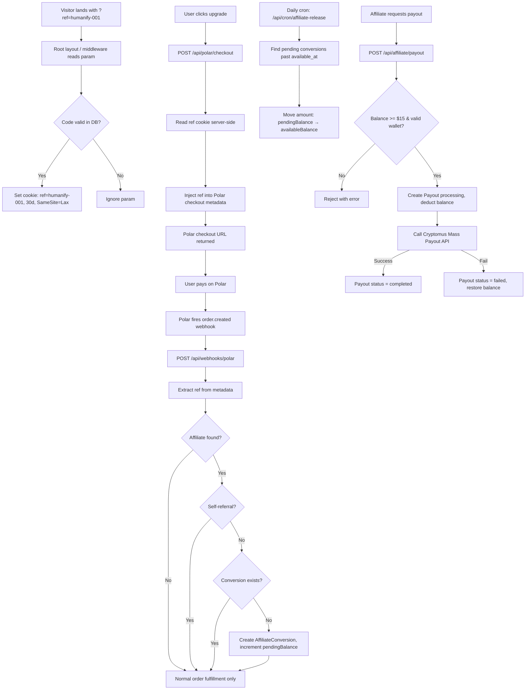

# Design Document: Affiliate Program

## Overview

The Affiliate Program adds a referral-based commission system to HumanifyLab. Authenticated users register as affiliates, receive a unique `humanify-NNN` referral code, and earn 25% of the first order amount for each referred user who converts. Commissions are held for 7 days before becoming available for USDT payout via Cryptomus Mass Payout API, with a $15 minimum threshold.

The feature integrates with the existing stack: Next.js 14 App Router, Prisma + PostgreSQL, Clerk auth, and the existing Polar webhook at `/api/webhooks/polar/route.ts`.

---

## Architecture



---

## Components and Interfaces

### New API Routes

| Route | Method | Auth | Purpose |
|---|---|---|---|
| `/api/affiliate/register` | POST | Clerk (required) | Register current user as affiliate; idempotent |
| `/api/affiliate/me` | GET | Clerk (required) | Return affiliate stats, conversions, payouts |
| `/api/affiliate/payout` | POST | Clerk (required) | Request USDT payout |
| `/api/cron/affiliate-release` | POST | Cron secret header | Release held commissions past 7-day hold |

### Modified Routes

- **`/api/polar/checkout/route.ts`** — reads `ref` cookie via `cookies()` and injects it into `metadata.ref` when present.
- **`/api/webhooks/polar/route.ts`** — after existing order fulfillment, extracts `metadata.ref`, looks up affiliate, runs self-referral check, deduplication check, then creates `AffiliateConversion`.

### Cookie Tracking

Cookie tracking is handled in a **Server Component layout wrapper** at `src/app/affiliate-tracker.tsx` (a server component rendered inside the root layout). It reads `searchParams` via a dedicated `<AffiliateTracker>` component that uses `next/headers` cookies API to set the `ref` cookie when a valid `?ref=` param is present.

Because Next.js App Router root layouts cannot directly access `searchParams`, the tracker is implemented as a thin server component placed in the root layout that reads the URL via `headers()` and sets the cookie via the `cookies()` API from `next/headers`. The cookie is set with `SameSite=Lax; Path=/; Max-Age=2592000` (30 days).

Alternatively, this can be handled in Next.js middleware (`middleware.ts`) which already runs on every request — this is the preferred approach since middleware has direct access to request URL and can set response cookies without a React component.

**Chosen approach: Next.js middleware** — extend `middleware.ts` to detect `?ref=` param, validate the code against the DB (via a lightweight Prisma call), and set/overwrite the cookie on the response.

### Cryptomus Mass Payout Integration

```
POST https://api.cryptomus.com/v1/payout
Headers:
  merchant: <CRYPTOMUS_MERCHANT_ID>
  sign: md5(base64(body) + CRYPTOMUS_API_KEY)
Body:
  {
    "amount": "<amount>",
    "currency": "USDT",
    "network": "TRON",  // or user-selected
    "order_id": "<payout.id>",
    "address": "<wallet_address>",
    "url_callback": "<NEXT_PUBLIC_APP_URL>/api/webhooks/cryptomus"
  }
```

A new `src/server/utils/cryptomus-client.ts` utility handles signing and calling the API.

---

## Data Models

### Prisma Schema Additions

```prisma
model Affiliate {
  id               String               @id @default(cuid())
  clerkId          String               @unique
  referralCode     String               @unique
  pendingBalance   Decimal              @default(0) @db.Decimal(10, 2)
  availableBalance Decimal              @default(0) @db.Decimal(10, 2)
  createdAt        DateTime             @default(now())
  updatedAt        DateTime             @updatedAt
  conversions      AffiliateConversion[]
  payouts          AffiliatePayout[]

  @@map("affiliate")
}

model AffiliateConversion {
  id            String    @id @default(cuid())
  affiliateId   String
  referredClerkId String
  orderId       String    @unique   // Polar order ID — prevents duplicate processing
  commission    Decimal   @db.Decimal(10, 2)
  status        String    @default("pending")  // pending | available
  availableAt   DateTime
  createdAt     DateTime  @default(now())
  affiliate     Affiliate @relation(fields: [affiliateId], references: [id])

  @@unique([affiliateId, referredClerkId])  // one conversion per referred user per affiliate
  @@map("affiliate_conversion")
}

model AffiliatePayout {
  id              String    @id @default(cuid())
  affiliateId     String
  amount          Decimal   @db.Decimal(10, 2)
  walletAddress   String
  status          String    @default("processing")  // processing | completed | failed
  cryptomusId     String?
  createdAt       DateTime  @default(now())
  updatedAt       DateTime  @updatedAt
  affiliate       Affiliate @relation(fields: [affiliateId], references: [id])

  @@map("affiliate_payout")
}
```

**Key design decisions:**
- `orderId @unique` on `AffiliateConversion` prevents duplicate webhook processing (idempotency key).
- `@@unique([affiliateId, referredClerkId])` enforces one-conversion-per-referred-user at the DB level.
- `Decimal` type for money to avoid floating-point errors.
- Referral code sequence is derived from `SELECT COUNT(*) FROM affiliate` + 1, zero-padded to 3 digits minimum.

---

## Correctness Properties

*A property is a characteristic or behavior that should hold true across all valid executions of a system — essentially, a formal statement about what the system should do. Properties serve as the bridge between human-readable specifications and machine-verifiable correctness guarantees.*

### Property 1: Referral code format and uniqueness

*For any* set of N affiliate registrations, every generated referral code SHALL match the pattern `/^humanify-\d{3,}$/` and all N codes SHALL be distinct from each other.

**Validates: Requirements 1.1, 1.2**

---

### Property 2: Registration idempotence

*For any* authenticated user, calling the registration endpoint twice SHALL return the same referral code both times and result in exactly one `Affiliate` record in the database.

**Validates: Requirements 1.3, 1.4**

---

### Property 3: New affiliate balance invariant

*For any* newly registered affiliate, `pendingBalance` SHALL equal `0.00` and `availableBalance` SHALL equal `0.00`.

**Validates: Requirements 1.5**

---

### Property 4: Valid ref cookie is set

*For any* valid referral code that exists in the database, loading any page with `?ref=<code>` SHALL result in a browser cookie named `ref` containing exactly that code, with a `Max-Age` of approximately 2592000 seconds (30 days) and `SameSite=Lax`.

**Validates: Requirements 2.1, 2.5**

---

### Property 5: Invalid ref is ignored

*For any* string that does not correspond to an existing affiliate's referral code, loading a page with `?ref=<string>` SHALL NOT set or modify the `ref` cookie.

**Validates: Requirements 2.2**

---

### Property 6: Cookie overwrite

*For any* two distinct valid referral codes A and B, if the `ref` cookie is set to A and then the user loads a page with `?ref=B`, the `ref` cookie SHALL contain B and the 30-day expiry SHALL be reset.

**Validates: Requirements 2.4**

---

### Property 7: Self-referral produces no conversion

*For any* affiliate, when an `order.created` webhook event arrives where the purchasing user's `clerkId` equals the affiliate's `clerkId` and the order metadata contains that affiliate's referral code, no `AffiliateConversion` record SHALL be created.

**Validates: Requirements 3.1**

---

### Property 8: Commission calculation correctness

*For any* `order.created` event with a valid referral code, no prior conversion for that referred user, and a `price_amount` of P cents, the created `AffiliateConversion.commission` SHALL equal `(P / 100) * 0.25` rounded to 2 decimal places.

**Validates: Requirements 4.2**

---

### Property 9: Conversion deduplication

*For any* `order.created` event processed twice (same `orderId`), exactly one `AffiliateConversion` record SHALL exist after both processing attempts, and the affiliate's `pendingBalance` SHALL reflect only one commission increment.

**Validates: Requirements 4.1, 4.3**

---

### Property 10: New conversion state invariant

*For any* newly created `AffiliateConversion`, `status` SHALL equal `"pending"` and `availableAt` SHALL be within 1 second of `createdAt + 7 days`.

**Validates: Requirements 4.4**

---

### Property 11: Pending balance increment on conversion

*For any* affiliate with `pendingBalance` of B before a new conversion with commission C is created, the affiliate's `pendingBalance` after SHALL equal `B + C`.

**Validates: Requirements 4.5**

---

### Property 12: Hold release balance transfer

*For any* set of `AffiliateConversion` records with `status = "pending"` and `availableAt` in the past, after the cron job runs: each such conversion SHALL have `status = "available"`, the affiliate's `pendingBalance` SHALL have decreased by the sum of those commissions, and `availableBalance` SHALL have increased by the same sum.

**Validates: Requirements 5.2**

---

### Property 13: Payout threshold enforcement

*For any* affiliate with `availableBalance` B, a payout request SHALL be rejected if and only if `B < 15.00`.

**Validates: Requirements 6.1, 6.2**

---

### Property 14: Wallet address length validation

*For any* string W, a payout request with wallet address W SHALL be rejected if `len(W) < 26` or `len(W) > 62`, and SHALL pass wallet validation if `26 <= len(W) <= 62`.

**Validates: Requirements 6.3, 6.4**

---

### Property 15: Payout balance deduction

*For any* affiliate with `availableBalance` B >= 15.00 and a valid wallet address, after a successful payout request the affiliate's `availableBalance` SHALL equal `B - B` (i.e., the full available balance is paid out) and an `AffiliatePayout` record with `status = "processing"` SHALL exist.

**Validates: Requirements 6.5**

---

### Property 16: Payout failure rollback

*For any* payout attempt where the Cryptomus API call fails, the affiliate's `availableBalance` SHALL be restored to its value before the payout request, and the `AffiliatePayout` record SHALL have `status = "failed"`.

**Validates: Requirements 6.7**

---

### Property 17: Processing lock prevents concurrent payouts

*For any* affiliate with an existing `AffiliatePayout` record with `status = "processing"`, any new payout request SHALL be rejected with an error.

**Validates: Requirements 6.8**

---

### Property 18: Ref cookie injected into checkout metadata

*For any* authenticated user with a valid `ref` cookie containing referral code R, the Polar checkout created SHALL include `metadata.ref = R`.

**Validates: Requirements 7.1**

---

### Property 19: Affiliate stats completeness

*For any* affiliate, `GET /api/affiliate/me` SHALL return a response containing `referralCode`, `referralUrl`, `conversionCount`, `pendingBalance`, `availableBalance`, and a `payouts` array where each entry includes `createdAt`, `amount`, `status`, and `cryptomusId` (nullable).

**Validates: Requirements 8.1, 8.2**

---

### Property 20: Order fulfillment is independent of commission outcome

*For any* `order.created` webhook event, regardless of whether commission processing succeeds, fails, or is skipped (invalid ref, self-referral, duplicate), the user's credits and plan SHALL be updated correctly.

**Validates: Requirements 9.4**

---

## Error Handling

| Scenario | Behavior |
|---|---|
| Registration when already an affiliate | Return existing record (200), no error |
| `?ref=` param with unknown code | Silently ignore, no cookie set |
| Self-referral detected in webhook | Log warning, skip commission, return 200 to Polar |
| Duplicate `orderId` in webhook | DB unique constraint prevents insert; log and continue |
| Payout below $15 threshold | 400 with `"Minimum payout is $15.00"` |
| Invalid wallet address length | 400 with `"Wallet address must be 26–62 characters"` |
| Concurrent payout while one is processing | 409 with `"A payout is already in progress"` |
| Cryptomus API failure | Restore balance, set payout status to `failed`, return 502 |
| Cryptomus API timeout | Same as failure — treat as failed, restore balance |
| Cron job DB error on single conversion | Log error, continue processing remaining conversions |
| Webhook commission error | Log error, still return 200 to Polar (order fulfillment must not fail) |

---

## Testing Strategy

### Property-Based Testing

Use **fast-check** (TypeScript-native PBT library) for all property tests. Each test runs a minimum of 100 iterations.

Tag format: `// Feature: affiliate-program, Property N: <property_text>`

Properties to implement as PBT tests:

- **Property 1** — `fc.array(fc.string())` as user IDs; verify code format regex and Set size equals array length
- **Property 2** — `fc.string()` as clerkId; call register twice, assert same code returned, count DB records = 1
- **Property 3** — `fc.string()` as clerkId; register, assert balances = 0
- **Property 4/5/6** — `fc.string()` as ref param; mock DB lookup; assert cookie set/not-set/overwritten
- **Property 7** — `fc.record({clerkId, referralCode})` where buyer = affiliate; assert no conversion created
- **Property 8** — `fc.integer({min: 100, max: 1000000})` as price_amount in cents; assert commission = amount/100*0.25
- **Property 9** — `fc.record({orderId, ...})` processed twice; assert exactly 1 conversion record
- **Property 10** — `fc.record(...)` for any conversion; assert status and availableAt invariants
- **Property 11** — `fc.decimal()` for balance B and commission C; assert B+C after conversion
- **Property 12** — `fc.array(fc.record({commission, ...}))` of past-due conversions; assert balance transfer
- **Property 13** — `fc.float({min: 0, max: 100})` as balance; assert threshold enforcement
- **Property 14** — `fc.string()` of varying lengths; assert accept/reject at boundaries 26 and 62
- **Property 15/16/17** — payout state machine properties with mocked Cryptomus
- **Property 18** — `fc.string()` as referral code in cookie; assert metadata injection
- **Property 19** — `fc.record(...)` for affiliate with N payouts; assert response shape
- **Property 20** — `fc.record(...)` for order events with various ref states; assert credits always updated

### Unit Tests

Focus on:
- `getPlanConfig` with each known product ID
- Referral code generation sequence (sequential counter)
- Cryptomus signature computation (`md5(base64(body) + apiKey)`)
- Cookie attribute validation (SameSite, Path, Max-Age)
- Self-referral detection logic in isolation

### Integration Tests

- Full webhook flow: valid ref → conversion created, balances updated
- Full webhook flow: self-referral → no conversion, order fulfilled
- Full webhook flow: no ref → order fulfilled, no affiliate records touched
- Cron job: pending conversions released, balances updated atomically
- Payout flow: Cryptomus success path end-to-end (with mocked Cryptomus)
- Payout flow: Cryptomus failure path with balance rollback

### Smoke Tests

- Cron endpoint responds to authorized requests
- Affiliate dashboard page renders for authenticated affiliate
- Affiliate dashboard redirects unauthenticated users
