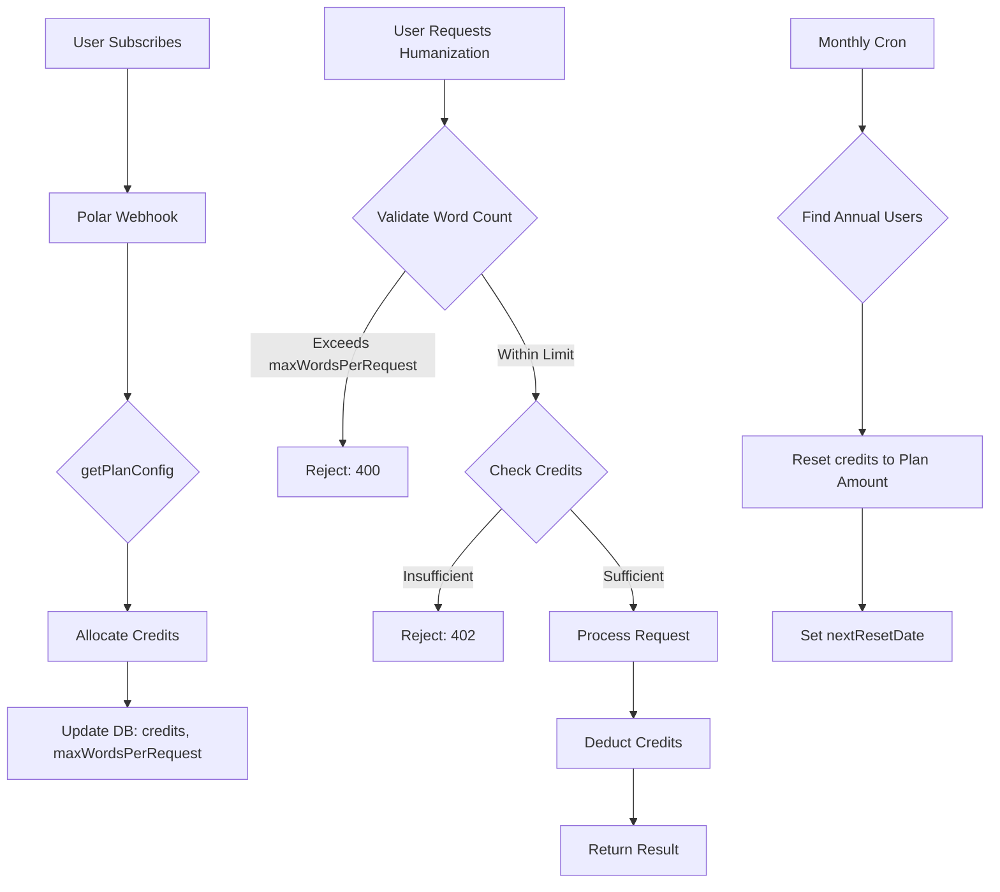

# Design Document: Increase Plan Word Limits

## Overview

This design specifies the implementation for increasing the word limits across all subscription plans (Basic: 5k→7k, Pro: 20k→25k, Ultra: 45k→50k). The change involves updating constant values in 5 locations across the codebase to maintain consistency between credit allocation, validation, UI display, and reset logic.

### Scope

The implementation updates word limit constants in:
- UI product descriptions (polar-products.ts)
- Webhook credit allocation (webhooks/polar/route.ts)
- API request validation (humanizer/route.ts and humanizer/stream/route.ts)
- Monthly credit reset logic (cron/reset-credits/route.ts)

### Key Constraints

- All 5 files must be updated atomically in a single deployment
- Changes are simple constant updates (no complex logic modifications)
- Must maintain backward compatibility with existing user credit balances
- Zero downtime deployment required

## Architecture

### Current System Architecture

The word limit system operates across three layers:

1. **Presentation Layer** (polar-products.ts)
   - Displays plan features and word limits to users
   - UI_DESCRIPTIONS constant contains marketing copy

2. **Business Logic Layer** (webhooks, API routes)
   - Validates word counts against plan limits
   - Allocates credits based on subscription tier
   - Enforces per-request word limits

3. **Data Layer** (database via Prisma)
   - Stores user credits (monthly allocation)
   - Stores extraCredits (one-time top-ups)
   - Stores maxWordsPerRequest (per-request limit)

### Credit System Model

```
User Credits = Monthly Plan Credits + Extra Credits (Top-ups)

Credit Deduction Priority:
1. Deduct from monthly plan credits first
2. If insufficient, deduct remainder from extra credits
3. Extra credits never expire (permanent balance)
```

### Data Flow Diagram



## Components and Interfaces

### 1. Product Configuration (polar-products.ts)

**Purpose**: Display plan features to users during checkout

**Current Constants**:
```typescript
const UI_DESCRIPTIONS: Record<string, string> = {
  "small": "• 5,000 words / mo\n• Up to 600 words per request",
  "medium": "• 20,000 words / mo\n• Up to 2,000 words per request",
  "large": "• 45,000 words / mo\n• Up to 3,000 words per request"
}
```

**Required Changes**:
- Update word limits in UI_DESCRIPTIONS
- Update per-request limits

### 2. Webhook Handler (webhooks/polar/route.ts)

**Purpose**: Allocate credits when users subscribe

**Current Function**:
```typescript
function getPlanConfig(productId: string): {
  credits: number;
  plan: string;
  maxWords: number;
  type: string;
} | null {
  if (productId === SMALL) return { credits: 5000, maxWords: 600, ... };
  if (productId === MEDIUM) return { credits: 20000, maxWords: 2000, ... };
  if (productId === LARGE) return { credits: 45000, maxWords: 3000, ... };
}
```

**Required Changes**:
- Update credits values
- Update maxWords values

### 3. Non-Streaming API (humanizer/route.ts)

**Purpose**: Validate requests and enforce credit limits

**Current Logic**:
```typescript
// Check if annual subscription needs credit reset
const planCredits = billingUser.subscriptionPlan === 'basic' ? 5000 
  : billingUser.subscriptionPlan === 'pro' ? 20000 
  : 45000;
```

**Required Changes**:
- Update ternary expression values

### 4. Streaming API (humanizer/stream/route.ts)

**Purpose**: Validate streaming requests and enforce credit limits

**Current Logic**:
```typescript
// Check if annual subscription needs credit reset
const planCredits = billingUser.subscriptionPlan === 'basic' ? 5000 
  : billingUser.subscriptionPlan === 'pro' ? 20000 
  : 45000;
```

**Required Changes**:
- Update ternary expression values (identical to route.ts)

### 5. Credit Reset Cron (cron/reset-credits/route.ts)

**Purpose**: Reset monthly credits for annual subscribers

**Current Function**:
```typescript
function getPlanCredits(plan: string): number {
  switch (plan) {
    case 'basic': return 5000;
    case 'pro': return 20000;
    case 'ultra': return 45000;
    default: return 5000;
  }
}
```

**Required Changes**:
- Update switch statement values

## Data Models

### User Model (Existing Schema)

```typescript
model User {
  id: String
  credits: Int @default(300)           // Monthly plan credits
  extraCredits: Int @default(0)        // Permanent top-up credits
  subscriptionPlan: String?            // "basic" | "pro" | "ultra"
  subscriptionType: String?            // "monthly" | "annual"
  maxWordsPerRequest: Int?             // Per-request word limit
  nextResetDate: DateTime?             // For annual subscriptions
  // ... other fields
}
```

**No schema changes required** - only the values assigned to these fields will change.

### Plan Configuration Mapping

| Plan  | Current Credits | New Credits | Current Max/Request | New Max/Request |
|-------|----------------|-------------|---------------------|-----------------|
| Basic | 5,000          | 7,000       | 600                 | 600             |
| Pro   | 20,000         | 25,000      | 2,000               | 2,000           |
| Ultra | 45,000         | 50,000      | 3,000               | 3,000           |

## Implementation Strategy

### Phase 1: Code Updates (Single Atomic Commit)

Update all 5 files in a single commit to ensure consistency:

1. **polar-products.ts**: Update UI_DESCRIPTIONS constant
2. **webhooks/polar/route.ts**: Update getPlanConfig function
3. **humanizer/route.ts**: Update planCredits ternary
4. **humanizer/stream/route.ts**: Update planCredits ternary
5. **cron/reset-credits/route.ts**: Update getPlanCredits function

### Phase 2: Deployment

Deploy all changes simultaneously:
- Single deployment ensures no inconsistency window
- No database migrations required
- No API version changes required

### Phase 3: Verification

Post-deployment checks:
1. Verify new subscriptions receive correct credits
2. Verify API validation uses new limits
3. Verify UI displays new limits
4. Monitor for any validation errors

### Backward Compatibility Strategy

**Existing Users**:
- Users with existing credit balances are unaffected
- Their current balance remains unchanged
- Next credit reset (monthly or annual) will use new limits

**In-Flight Requests**:
- No in-flight requests during deployment (stateless API)
- Each request is independent and atomic

**Credit Balances**:
- Users with < 10k credits keep their balance
- Users with > 10k credits (from top-ups) keep their balance
- No data migration needed

### Edge Cases

1. **User with 3,000 credits subscribes to Basic plan**
   - Webhook sets credits to 7,000 (replaces old value)
   - Extra credits remain unchanged

2. **Annual subscriber with 2,000 credits remaining**
   - Next monthly reset gives them 7,000 credits
   - Handled by cron job using new getPlanCredits values

3. **User mid-request during deployment**
   - Request completes with old or new limits (both valid)
   - No partial state possible (atomic operations)

## Correctness Properties

*A property is a characteristic or behavior that should hold true across all valid executions of a system-essentially, a formal statement about what the system should do. Properties serve as the bridge between human-readable specifications and machine-verifiable correctness guarantees.*

### Property 1: Credit Allocation Consistency

*For any* subscription event processed by the webhook, the credits allocated must match the plan's word limit as defined in getPlanConfig, and this value must equal the corresponding value in getPlanCredits used by the cron reset.

**Validates: Requirements 1.1, 1.2**

### Property 2: Validation Consistency

*For any* humanization request, the maxWordsPerRequest validation limit must match the maxWords value assigned during subscription for that user's plan tier.

**Validates: Requirements 1.3**

### Property 3: UI Display Accuracy

*For any* plan tier displayed in the UI, the word limit shown in UI_DESCRIPTIONS must match the credits value allocated by getPlanConfig for that tier's product ID.

**Validates: Requirements 1.4**

### Property 4: Reset Consistency

*For any* annual subscriber reaching their nextResetDate, the credits allocated by the reset logic must match both the getPlanCredits function and the getPlanConfig function for their subscription plan.

**Validates: Requirements 1.5**

### Property 5: Backward Compatibility

*For any* existing user with a credit balance before deployment, their balance must remain unchanged immediately after deployment, and only change upon their next subscription event or reset date.

**Validates: Requirements 2.1**

### Property 6: Atomic Deployment

*For any* point in time after deployment begins, either all 5 files reflect the old values or all 5 files reflect the new values - no mixed state exists.

**Validates: Requirements 2.2**

## Error Handling

### Deployment Errors

**Scenario**: Deployment fails mid-process

**Handling**:
- Atomic deployment ensures rollback to previous version
- No partial updates possible
- Users continue with old limits until successful deployment

### Validation Errors

**Scenario**: User attempts request exceeding new limit

**Handling**:
- API returns 400 with clear error message
- Error includes actual word count and limit
- No credits deducted

### Credit Allocation Errors

**Scenario**: Webhook fails to update user credits

**Handling**:
- Webhook logs error with user ID and product ID
- Returns 500 to Polar (triggers retry)
- User can contact support if issue persists

### Reset Errors

**Scenario**: Cron job fails to reset user credits

**Handling**:
- Cron logs error with user ID
- Continues processing other users
- Returns summary with error count
- Failed users will be caught in next cron run

## Testing Strategy

### Unit Testing

**Test Coverage**:
1. getPlanConfig returns correct values for each product ID
2. getPlanCredits returns correct values for each plan tier
3. planCredits ternary evaluates correctly for each plan
4. UI_DESCRIPTIONS contains correct word limits

**Example Unit Test**:
```typescript
describe('getPlanConfig', () => {
  it('returns correct credits for basic plan', () => {
    const config = getPlanConfig(env.POLAR_PRODUCT_SMALL);
    expect(config?.credits).toBe(7000);
    expect(config?.maxWords).toBe(600);
  });
  
  it('returns correct credits for pro plan', () => {
    const config = getPlanConfig(env.POLAR_PRODUCT_MEDIUM);
    expect(config?.credits).toBe(25000);
    expect(config?.maxWords).toBe(2000);
  });
  
  it('returns correct credits for ultra plan', () => {
    const config = getPlanConfig(env.POLAR_PRODUCT_LARGE);
    expect(config?.credits).toBe(50000);
    expect(config?.maxWords).toBe(3000);
  });
});
```

### Property-Based Testing

**Property Test 1: Credit Allocation Consistency**
```typescript
// Feature: increase-plan-word-limits, Property 1: Credit allocation consistency
test('webhook credits match cron reset credits for all plans', () => {
  fc.assert(
    fc.property(
      fc.constantFrom('basic', 'pro', 'ultra'),
      (plan) => {
        const webhookConfig = getPlanConfig(getProductIdForPlan(plan));
        const cronCredits = getPlanCredits(plan);
        return webhookConfig?.credits === cronCredits;
      }
    ),
    { numRuns: 100 }
  );
});
```

**Property Test 2: Validation Consistency**
```typescript
// Feature: increase-plan-word-limits, Property 2: Validation consistency
test('maxWordsPerRequest matches plan allocation for all plans', () => {
  fc.assert(
    fc.property(
      fc.constantFrom('basic', 'pro', 'ultra'),
      (plan) => {
        const config = getPlanConfig(getProductIdForPlan(plan));
        const expectedMaxWords = plan === 'basic' ? 600 
          : plan === 'pro' ? 2000 
          : 3000;
        return config?.maxWords === expectedMaxWords;
      }
    ),
    { numRuns: 100 }
  );
});
```

**Property Test 3: UI Display Accuracy**
```typescript
// Feature: increase-plan-word-limits, Property 3: UI display accuracy
test('UI descriptions match allocated credits for all tiers', () => {
  fc.assert(
    fc.property(
      fc.constantFrom('small', 'medium', 'large'),
      (tier) => {
        const uiDescription = UI_DESCRIPTIONS[tier];
        const plan = tier === 'small' ? 'basic' 
          : tier === 'medium' ? 'pro' 
          : 'ultra';
        const config = getPlanConfig(getProductIdForPlan(plan));
        
        // Extract word limit from UI description
        const match = uiDescription.match(/• ([\d,]+) words/);
        const uiWords = match ? parseInt(match[1].replace(',', '')) : 0;
        
        return uiWords === config?.credits;
      }
    ),
    { numRuns: 100 }
  );
});
```

### Integration Testing

**Test Scenarios**:

1. **New Subscription Flow**
   - Simulate webhook event for each plan tier
   - Verify user receives correct credits and maxWordsPerRequest
   - Verify user can make requests up to their limit

2. **Credit Reset Flow**
   - Create annual subscriber with past nextResetDate
   - Trigger cron job
   - Verify credits reset to correct amount

3. **API Validation Flow**
   - Create user with each plan tier
   - Submit requests at various word counts
   - Verify validation accepts/rejects correctly

4. **Backward Compatibility**
   - Create user with old credit balance (e.g., 3000)
   - Deploy new code
   - Verify balance unchanged
   - Trigger reset
   - Verify new balance uses new limits

### Manual Testing Checklist

- [ ] Subscribe to Basic plan → verify 7,000 credits allocated
- [ ] Subscribe to Pro plan → verify 25,000 credits allocated
- [ ] Subscribe to Ultra plan → verify 50,000 credits allocated
- [ ] Submit 700 word request as Basic user → verify rejected
- [ ] Submit 500 word request as Basic user → verify accepted
- [ ] Submit 2,500 word request as Pro user → verify rejected
- [ ] Submit 1,500 word request as Pro user → verify accepted
- [ ] Check pricing page → verify UI shows new limits
- [ ] Trigger cron reset → verify annual users get new limits
- [ ] Check existing user balance → verify unchanged until reset

### Deployment Verification

**Post-Deployment Checks**:
1. Monitor webhook logs for successful credit allocation
2. Monitor API logs for validation errors (should be none)
3. Check Sentry for any unexpected errors
4. Verify pricing page displays new limits
5. Test new subscription flow in production

**Rollback Criteria**:
- Webhook failing to allocate credits
- API rejecting valid requests
- Users reporting incorrect credit amounts
- Any critical errors in logs

## Appendix: File Change Summary

### File 1: src/lib/polar-products.ts

**Lines to Change**: 23-51 (UI_DESCRIPTIONS constant)

**Changes**:
- Line 26: `5,000` → `7,000`
- Line 27: `600` → `600` (unchanged)
- Line 36: `20,000` → `25,000`
- Line 37: `2,000` → `2,000` (unchanged)
- Line 48: `45,000` → `50,000`
- Line 49: `3,000` → `3,000` (unchanged)

### File 2: src/app/api/webhooks/polar/route.ts

**Lines to Change**: 44-52 (getPlanConfig function)

**Changes**:
- Line 46: `credits: 5000` → `credits: 7000`
- Line 46: `maxWords: 600` → `maxWords: 600` (unchanged)
- Line 49: `credits: 20000` → `credits: 25000`
- Line 49: `maxWords: 2000` → `maxWords: 2000` (unchanged)
- Line 52: `credits: 45000` → `credits: 50000`
- Line 52: `maxWords: 3000` → `maxWords: 3000` (unchanged)

### File 3: src/app/api/humanizer/route.ts

**Lines to Change**: 139-141 (planCredits ternary)

**Changes**:
- Line 139: `5000` → `7000`
- Line 140: `20000` → `25000`
- Line 140: `45000` → `50000`

### File 4: src/app/api/humanizer/stream/route.ts

**Lines to Change**: 127-129 (planCredits ternary)

**Changes**:
- Line 127: `5000` → `7000`
- Line 128: `20000` → `25000`
- Line 128: `45000` → `50000`

### File 5: src/app/api/cron/reset-credits/route.ts

**Lines to Change**: 7-17 (getPlanCredits function)

**Changes**:
- Line 10: `return 5000` → `return 7000`
- Line 12: `return 20000` → `return 25000`
- Line 14: `return 45000` → `return 50000`
- Line 16: `return 5000` → `return 7000`
