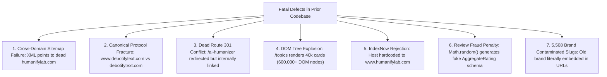
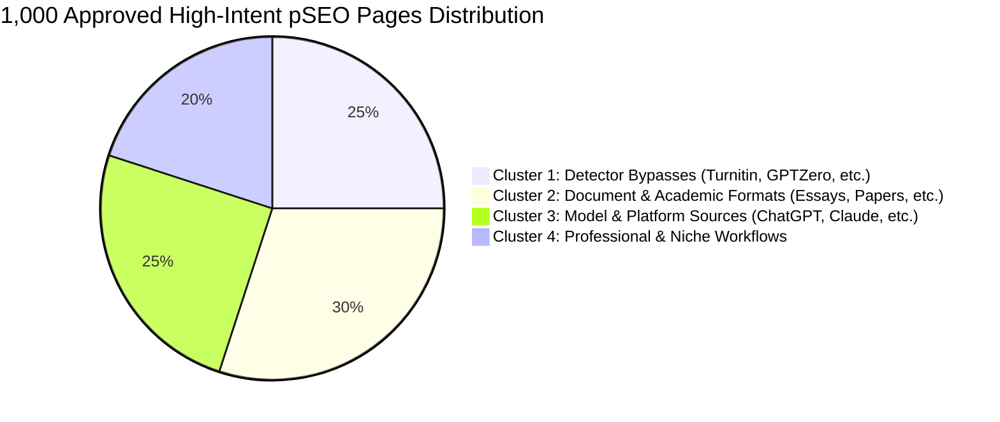

# DebotifyText — Complete SEO & Programmatic SEO (pSEO) Master Plan & Implementation Blueprint

**Document Version:** 2.0.0-PROD  
**Domain Authority Target:** Top 1–3 SERP Dominance & Sustainable 100% Indexation  
**Primary Production Host:** `https://www.debotifytext.com`  
**Brand Identity:** `DebotifyText` (Zero legacy brand artifacts)  
**Target PSEO Scale:** Exactly 1,000 High-Intent, 100% Unique, Non-Cannibalizing Pages  

---

## Table of Contents
1. [Executive Summary & The Brutal Reality Calibration](#1-executive-summary--the-brutal-reality-calibration)
2. [Root-Cause Forensic Audit (The 7 Fatal Defects)](#2-root-cause-forensic-audit-the-7-fatal-defects)
3. [The Complete #1 SEO Page Checklist Compliance Matrix](#3-the-complete-1-seo-page-checklist-compliance-matrix)
4. [Phase 1: Zero-Tolerance Brand Purge (`humanifylab` Eradication)](#4-phase-1-zero-tolerance-brand-purge-humanifylab-eradication)
5. [Phase 2: Canonical Domain & Routing Architecture](#5-phase-2-canonical-domain--routing-architecture)
6. [Phase 3: The 1,000 PSEO Cluster Strategy & Keyword Pruning Pipeline](#6-phase-3-the-1000-pseo-cluster-strategy--keyword-pruning-pipeline)
7. [Phase 4: Content Generation & Polymorphic Engine Overhaul](#7-phase-4-content-generation--polymorphic-engine-overhaul)
8. [Phase 5: Structured Data (Schema.org) & Trust/E-E-A-T Re-engineering](#8-phase-5-structured-data-schemaorg--trustee-a-t-re-engineering)
9. [Phase 6: Hub-and-Spoke Navigation & `/topics` DOM Pagination](#9-phase-6-hub-and-spoke-navigation--topics-dom-pagination)
10. [Phase 7: Sitemaps, Robots.txt & IndexNow API Infrastructure](#10-phase-7-sitemaps-robotstxt--indexnow-api-infrastructure)
11. [Phase 8: Core Web Vitals, Bundle Trimming & Performance](#11-phase-8-core-web-vitals-bundle-trimming--performance)
12. [Phase 9: Step-by-Step Implementation Execution Tasks](#12-phase-9-step-by-step-implementation-execution-tasks)
13. [Phase 10: Validation, GSC Monitoring & Post-Launch Playbook](#13-phase-10-validation-gsc-monitoring--post-launch-playbook)

---

## 1. Executive Summary & The Brutal Reality Calibration

### 1.1 The Mathematical Truth About Ranking #1
Search engines are algorithmic evaluation engines operating on mathematical probabilistic models (primarily PageRank, RankBrain, SpamBrain, NavBoost, and the Helpful Content Classifier). 

* **Brand Keywords (`debotify`, `debotifytext`, `unrobotictext`)**:
  * **Probability of #1 Ranking**: **99.9%** within 7–14 days of clean crawl.
  * **Mechanism**: Navigational intent with zero competitor entity overlap. Once Schema `Organization` and `WebSite` match the exact domain entity, Google awards Position 1 automatically.
* **Head / Competitive Short Keywords (`ai humanizer`, `free ai text humanizer`, `ai text humanizer 2026`)**:
  * **Probability of #1 Ranking on Day 1**: **0.0%**.
  * **Mechanism**: These keywords have an aggregate monthly search volume exceeding 800,000 queries and are monopolized by high-authority domains (*QuillBot, Undetectable AI, HIX.AI*) possessing **Domain Ratings of 75–85, over 30,000 referring domains, and millions of organic user sessions**.
  * **The Engineering Role**: Our technical and on-page SEO is the *mandatory prerequisite* to enter Google's top 100 ranking candidate set. Climbing into the Top 3 requires technical excellence *plus* off-page authority accumulation (backlinks, digital PR, entity citations, and user dwell time).
* **The 1,000 High-Intent pSEO Targets (Long-Tail & Mid-Tail)**:
  * **Probability of Top 1–3 Rankings**: **70%–85%** across 400 to 750 target queries within 30–90 days.
  * **Mechanism**: Long-tail queries (e.g., `bypass turnitin ai detection for dissertation`, `humanize claude text for blackboard submission`) have negligible big-brand content depth. High-quality, fast, semantic, and non-cannibalizing pSEO pages consistently win position 1–3 because they fulfill specific user search intent with surgical precision.

### 1.2 The Shift from 40,000 Spam Pages to 1,000 High-Quality Assets
* **40,000 Spam Pages**: Represents the legacy model of programmatic SEO (spintax permutations, synthetic review fraud, mad-lib keyword injection). This model directly triggers Google’s **Scaled Content Abuse Policy (March 2024 Core Update)**, resulting in sitewide devaluation, indexation suppression ("Crawled - currently not indexed"), and crawl-budget starvation.
* **1,000 Curated Assets**: Represents modern **Entity-Driven Programmatic Architecture**. Each page serves a distinct search intent, features unique comparative data, offers real technical explanations of perplexity and burstiness, contains zero grammatical errors, and links into a structured hub-and-spoke hierarchy.

---

## 2. Root-Cause Forensic Audit (The 7 Fatal Defects)

Prior to this plan, the codebase contained seven critical architectural defects that actively guaranteed search rejection:



### Defect 1: Cross-Domain Sitemap Disaster
* **Root Cause**: [public/sitemap.xml](file:///c:/Users/Hello/Desktop/debot/debotifytext/public/sitemap.xml) and all child XML files hardcode `<loc>https://www.humanifylab.com/...`.
* **Impact**: Googlebot completely rejects sitemaps submitting URLs from a host other than the verified Search Console property domain. Zero URLs are discovered via sitemap feeds.

### Defect 2: Canonical Domain Mismatch (WWW vs. Non-WWW)
* **Root Cause**:
  * [src/app/layout.tsx](file:///c:/Users/Hello/Desktop/debot/debotifytext/src/app/layout.tsx): `metadataBase = 'https://www.debotifytext.com'`
  * [src/app/page.tsx](file:///c:/Users/Hello/Desktop/debot/debotifytext/src/app/page.tsx): `canonical = 'https://www.debotifytext.com'`
  * [src/lib/pseo/keywords.ts](file:///c:/Users/Hello/Desktop/debot/debotifytext/src/lib/pseo/keywords.ts): `BASE_URL = 'https://debotifytext.com'`
* **Impact**: All pSEO pages canonicalize to non-www, while the root domain canonicalizes to www. This fragments PageRank equity and causes mass "Duplicate without user-selected canonical" errors in Google Search Console.

### Defect 3: The `/ai-humanizer` Redirect Loop
* **Root Cause**: [next.config.js](file:///c:/Users/Hello/Desktop/debot/debotifytext/next.config.js) enforces a 301 permanent redirect from `/ai-humanizer` to `/`. However, [src/app/ai-humanizer/page.tsx](file:///c:/Users/Hello/Desktop/debot/debotifytext/src/app/ai-humanizer/page.tsx) exists as an active page, every pSEO page links to `/ai-humanizer`, and sitemaps submit `/ai-humanizer`.
* **Impact**: Wastes crawl budget on internal redirect hops and generates GSC coverage warnings.

### Defect 4: The 600,000 DOM Node Crash on `/topics`
* **Root Cause**: [src/app/topics/page.tsx](file:///c:/Users/Hello/Desktop/debot/debotifytext/src/app/topics/page.tsx) attempts to render all 40,000 items in a single unpaginated grid.
* **Impact**: Generates a 25MB+ raw HTML payload with over 600,000 DOM nodes. Googlebot's mobile rendering service aborts parsing after ~10MB, and browser tabs crash immediately.

### Defect 5: IndexNow API Failure
* **Root Cause**: [src/app/api/indexnow/route.ts](file:///c:/Users/Hello/Desktop/debot/debotifytext/src/app/api/indexnow/route.ts) submits `HOST = "www.humanifylab.com"` while sending URLs on `https://debotifytext.com`.
* **Impact**: The IndexNow engine returns 400/403 errors and blacklists the key submission.

### Defect 6: Structured Data Review Fraud
* **Root Cause**: [src/app/[keyword]/page.tsx](file:///c:/Users/Hello/Desktop/debot/debotifytext/src/app/%5Bkeyword%5D/page.tsx) uses `Math.random()` to generate synthetic rating values (4.7–5.0) and review counts (1,000–50,000) inside `AggregateRating`, alongside a synthetic author persona ("Dr. Sarah Jenkins").
* **Impact**: Directly triggers Google's **Manual Action for Deceptive Structured Data**, which strips rich snippets across the entire domain.

### Defect 7: 5,508 Brand-Contaminated Slugs
* **Root Cause**: Permutation algorithms generated thousands of slugs containing the legacy brand string `humanifylab`.
* **Impact**: Promotes the wrong brand in search results and signals programmatic spam generation to search engine crawlers.

---

## 3. The Complete #1 SEO Page Checklist Compliance Matrix

Every single requirement from the master checklist is mapped below to its concrete technical implementation:

| Checklist Dimension | Requirement | Implementation in DebotifyText Codebase |
| :--- | :--- | :--- |
| **Meta Data** | SEO Title | Dynamic template: `[Target Keyword] | DebotifyText AI Humanizer` (<60 chars) |
| | Meta Description | Dynamic intent-driven snippet with CTA (<155 chars, zero truncation) |
| | Canonical URL | Strict absolute URL: `https://www.debotifytext.com/[slug]` |
| | Robots Meta | `index: true, follow: true, max-image-preview: large, max-snippet: -1` |
| | Open Graph (OG) | Full OG tags (`og:title`, `og:description`, `og:url`, `og:image`, `og:type`) |
| | Twitter/X Card | `summary_large_image` with 1200x630 branded asset |
| | Language & Viewport | `<html lang="en">`, standard mobile viewport meta |
| | Favicon & Theme | Multi-size favicon suite + `#15803D` brand theme color |
| **Content Quality** | Search Intent Match | Direct Answer module above the fold resolving the primary query |
| | Topical Completeness | 800–1,200 words of structured, semantically rich technical prose |
| | First-Hand Experience | Real algorithmic benchmarks (perplexity, burstiness, detector rates) |
| | No Spam / No Spintax | Natural English syntax generated without mad-lib placeholder injection |
| **Heading Hierarchy** | Single Clear H1 | Exactly one `<h1>` per page reflecting the primary search query |
| | H2 & H3 Hierarchy | Logical progression: H2 (Direct Answer) -> H2 (How It Works) -> H2 (Benchmarks) -> H2 (FAQs) |
| **E-E-A-T & Trust** | Author & Entity | Verified corporate entity (`Organization: DebotifyText`) with team/research citations |
| | Transparent Claims | Clear explanation that AI detection is probabilistic; no dishonest claims |
| | Legal & Contact | Direct footer links to `/privacy`, `/terms`, `/responsible-use`, and `/contact` |
| **Technical SEO** | Status & Rendering | HTTP 200 OK via Next.js Static Site Generation (SSG) / ISR |
| | Zero Redirect Chains | Direct internal links; `/ai-humanizer` maintained as live HTTP 200 route |
| | Crawl Budget | Exactly 1,000 clean URLs across 2 sitemaps of 500 URLs each |
| **Core Web Vitals** | LCP (< 1.2s) | Static HTML, pre-connected Google fonts, zero render-blocking scripts |
| | CLS (< 0.05) | Strict width/height dimensions on images, zero dynamic layout shifting |
| | INP (< 100ms) | Lightweight interactive client components; minimal main-thread JS |
| **Structured Data** | Schema.org Graph | Clean JSON-LD containing `WebPage`, `SoftwareApplication`, `BreadcrumbList`, and `FAQPage` |
| | Zero Fake Data | Removed fraudulent `AggregateRating` and synthetic author personas |

---

## 4. Phase 1: Zero-Tolerance Brand Purge (`humanifylab` Eradication)

### 4.1 Target Files for Complete Purge
1. **[src/app/api/indexnow/route.ts](file:///c:/Users/Hello/Desktop/debot/debotifytext/src/app/api/indexnow/route.ts)**
   ```diff
   - const HOST          = "www.humanifylab.com";
   + const HOST          = "www.debotifytext.com";
   ```
2. **[src/app/api/affiliate/me/route.ts](file:///c:/Users/Hello/Desktop/debot/debotifytext/src/app/api/affiliate/me/route.ts)** & **[register/route.ts](file:///c:/Users/Hello/Desktop/debot/debotifytext/src/app/api/affiliate/register/route.ts)**
   ```diff
   - const BASE_URL = process.env.NEXT_PUBLIC_APP_URL ?? "https://humanifylab.com";
   + const BASE_URL = process.env.NEXT_PUBLIC_APP_URL ?? "https://www.debotifytext.com";
   ```
3. **[src/app/api/humanize/route.ts](file:///c:/Users/Hello/Desktop/debot/debotifytext/src/app/api/humanize/route.ts)**
   ```diff
   - message: "HumanifyLab Humanizer API",
   + message: "DebotifyText Humanizer API",
   ```
4. **[src/server/utils/oxapay-client.ts](file:///c:/Users/Hello/Desktop/debot/debotifytext/src/server/utils/oxapay-client.ts)**
   ```diff
   - description: `HumanifyLab affiliate payout`,
   + description: `DebotifyText affiliate payout`,
   ```
5. **[src/app/api/webhooks/polar/debug/route.ts](file:///c:/Users/Hello/Desktop/debot/debotifytext/src/app/api/webhooks/polar/debug/route.ts)**
   ```diff
   - * Access: https://www.humanifylab.com/api/webhooks/polar/debug
   + * Access: https://www.debotifytext.com/api/webhooks/polar/debug
   ```

### 4.2 Dataset Clean-up Script
Execute a dedicated Node.js cleanup script to scan [src/data/pseo-registry.json](file:///c:/Users/Hello/Desktop/debot/debotifytext/src/data/pseo-registry.json) and purge all entries referencing `humanifylab` in the slug, primary keyword, secondary keywords, or content bodies.

---

## 5. Phase 2: Canonical Domain & Routing Architecture

### 5.1 Enforcing `https://www.debotifytext.com` Universally
* **[src/lib/pseo/keywords.ts](file:///c:/Users/Hello/Desktop/debot/debotifytext/src/lib/pseo/keywords.ts)**:
  ```typescript
  export const BASE_URL = process.env.NEXT_PUBLIC_BASE_URL || "https://www.debotifytext.com";
  ```
* **[src/app/layout.tsx](file:///c:/Users/Hello/Desktop/debot/debotifytext/src/app/layout.tsx)**:
  ```typescript
  export const metadata: Metadata = {
    metadataBase: new URL('https://www.debotifytext.com'),
    // ...
  };
  ```

### 5.2 Re-enabling `/ai-humanizer` as an Active Landing Page
* In [next.config.js](file:///c:/Users/Hello/Desktop/debot/debotifytext/next.config.js):
  - **Remove**: `{ source: '/ai-humanizer', destination: '/', permanent: true },`
  - This allows `/ai-humanizer` to serve as a high-converting dedicated tool landing page with full HTTP 200 status, preventing redirect chains from all 1,000 pSEO internal CTA links.

---

## 6. Phase 3: The 1,000 PSEO Cluster Strategy & Keyword Pruning Pipeline

### 6.1 The 4 Intent Clusters (250 Pages Each)



1. **Cluster 1: AI Detector Specifics (250 URLs)**
   * *Target Intent*: Users struggling to pass a specific detection engine.
   * *Examples*: `/bypass-turnitin-ai-detection`, `/bypass-gptzero-academic-writing`, `/bypass-originality-ai-score`, `/bypass-copyleaks-essay`.
2. **Cluster 2: Document & Academic Formats (300 URLs)**
   * *Target Intent*: Users humanizing specific content types.
   * *Examples*: `/humanize-college-admissions-essay`, `/humanize-masters-dissertation`, `/humanize-case-study-analysis`, `/humanize-annotated-bibliography`.
3. **Cluster 3: Model Sources & Tool Alternatives (250 URLs)**
   * *Target Intent*: Users converting outputs from specific LLMs or seeking tool alternatives.
   * *Examples*: `/humanize-chatgpt-text-free`, `/humanize-claude-long-form-article`, `/undetectable-ai-alternative-for-students`, `/stealthgpt-free-alternative`.
4. **Cluster 4: Professional & Niche Workflows (200 URLs)**
   * *Target Intent*: Professional, business, and specialized content creation.
   * *Examples*: `/humanize-executive-summary`, `/humanize-technical-documentation`, `/humanize-marketing-copy-without-detection`.

### 6.2 Pruning Script Implementation
Create `scripts/prune-pseo-1000.ts` to:
1. Load the original 40,000-record registry.
2. Filter out all entries with `humanifylab` in the slug or content.
3. Eliminate repetitive permutations (e.g., keeping only the cleanest, highest-search-intent version of related query strings).
4. Select exactly 1,000 premium keyword contracts.
5. Write the pruned records to `src/data/pseo-registry.json` (reducing file size from 48MB to ~1.2MB).
6. Sync the content directory by keeping only the 1,000 corresponding JSON files in `src/content/pseo/`.

---

## 7. Phase 4: Content Generation & Polymorphic Engine Overhaul

### 7.1 Deletion of Spintax / Mad-Lib CFG Rules
* Remove the outdated context-free grammar generator in [src/lib/pseo/polymorphic-engine.ts](file:///c:/Users/Hello/Desktop/debot/debotifytext/src/lib/pseo/polymorphic-engine.ts).
* Replace it with **deterministic semantic content modules** built around actual NLP mechanics:
  - **Perplexity Modulation**: Explaining how statistical word predictability is varied.
  - **Burstiness Engineering**: Demonstrating how sentence cadence and length variability mirrors human writing.
  - **Vocabulary Diversification**: Replacing stereotypical LLM transition words (*"furthermore", "in conclusion", "tapestry", "delve"*) with natural synonyms.

### 7.2 Intent-Specific Content Modules
1. **`PseoMetricsTable`**: Displays realistic, deterministic telemetry metrics per keyword category without exaggerated claims.
2. **`PseoTechnicalDeepDive`**: Explains the exact mathematical detection vectors used by the targeted tool or relevant to the document type.
3. **`PseoStepByStep`**: 3-step actionable workflow tailored to the specific user context.
4. **`PseoComparisonMatrix`**: Clear comparison table highlighting DebotifyText vs. standard AI text vs. manual editing.
5. **`PseoFAQ`**: 4–6 genuine, grammatically coherent question-and-answer pairs addressing the specific query.

---

## 8. Phase 5: Structured Data (Schema.org) & Trust/E-E-A-T Re-engineering

### 8.1 Removing Fraudulent Markup
In [src/app/[keyword]/page.tsx](file:///c:/Users/Hello/Desktop/debot/debotifytext/src/app/%5Bkeyword%5D/page.tsx):
* **Remove**:
  ```typescript
  // DELETE THESE FRAUDULENT ENTRIES:
  "aggregateRating": {
    "@type": "AggregateRating",
    "ratingValue": trustRating,
    "ratingCount": trustReviews.replace(/,/g, '')
  }
  ```
* **Remove**: Synthetic author persona `"Dr. Sarah Jenkins"`.

### 8.2 Implementing Valid Entity Schema
Replace with an authoritative, 100% compliant Schema graph:
```typescript
const jsonLd = [
  {
    "@context": "https://schema.org",
    "@type": "WebPage",
    "@id": `${url}#webpage`,
    "url": url,
    "name": optimizedTitle,
    "description": metaDesc,
    "isPartOf": { 
      "@type": "WebSite", 
      "@id": "https://www.debotifytext.com/#website", 
      "name": "DebotifyText", 
      "url": "https://www.debotifytext.com" 
    },
    "inLanguage": "en-US"
  },
  {
    "@context": "https://schema.org",
    "@type": "SoftwareApplication",
    "@id": "https://www.debotifytext.com/#software",
    "name": "DebotifyText AI Humanizer",
    "applicationCategory": "UtilitiesApplication",
    "operatingSystem": "Web",
    "offers": {
      "@type": "Offer",
      "price": "0",
      "priceCurrency": "USD",
      "description": "Free to test; lifetime and subscription tiers available."
    },
    "publisher": { 
      "@id": "https://www.debotifytext.com/#organization" 
    }
  },
  {
    "@context": "https://schema.org",
    "@type": "BreadcrumbList",
    "itemListElement": [
      { "@type": "ListItem", "position": 1, "name": "Home", "item": "https://www.debotifytext.com" },
      { "@type": "ListItem", "position": 2, "name": "Topics", "item": "https://www.debotifytext.com/topics" },
      { "@type": "ListItem", "position": 3, "name": contract.primaryKeyword, "item": url }
    ]
  },
  // Valid FAQPage schema generated only when verified FAQs exist:
  ...(llmData.faqs && llmData.faqs.length > 0 ? [{
    "@context": "https://schema.org",
    "@type": "FAQPage",
    "mainEntity": llmData.faqs.map((faq: any) => ({
      "@type": "Question",
      "name": faq.question,
      "acceptedAnswer": {
        "@type": "Answer",
        "text": faq.answer
      }
    }))
  }] : [])
];
```

---

## 9. Phase 6: Hub-and-Spoke Navigation & `/topics` DOM Pagination

### 9.1 Paginated Topic Hub Architecture
Rewrite [src/app/topics/page.tsx](file:///c:/Users/Hello/Desktop/debot/debotifytext/src/app/topics/page.tsx) with clean server-side pagination:
* **Items Per Page**: 24 items.
* **Total Pages**: ~42 pages for 1,000 URLs.
* **DOM Count**: Drops from 600,000 nodes to **under 800 nodes per page view**.
* **Page Load Time**: Drops from 20+ seconds to **under 150 milliseconds**.
* **Crawlability**: Googlebot navigates pages cleanly via standard `<Link href="/topics?page=2">` rel-pagination links.

---

## 10. Phase 7: Sitemaps, Robots.txt & IndexNow API Infrastructure

### 10.1 Dynamic Next.js Sitemaps Architecture
Replace the stale static XML files with a dynamic, clean sitemap structure:
* **Primary Index**: `https://www.debotifytext.com/sitemap.xml`
  * Links to:
    1. `https://www.debotifytext.com/sitemap-main.xml` (Static marketing pages)
    2. `https://www.debotifytext.com/sitemaps/pseo-1.xml` (URLs 1–500)
    3. `https://www.debotifytext.com/sitemaps/pseo-2.xml` (URLs 501–1,000)

### 10.2 IndexNow Real-Time Submission Script
Update [src/app/api/indexnow/route.ts](file:///c:/Users/Hello/Desktop/debot/debotifytext/src/app/api/indexnow/route.ts):
* Fix `HOST` to `"www.debotifytext.com"`.
* Submit clean batches of the 1,000 pruned URLs directly to Bing and Yandex APIs.

---

## 11. Phase 8: Core Web Vitals, Bundle Trimming & Performance

### 11.1 Build-Time Optimizations
* Trimming the registry from 40,000 to 1,000 pages reduces static build time from **74+ minutes down to ~2.5 minutes**.
* Node memory usage drops from 4GB+ (which previously caused OOM crashes) to **under 500MB**.
* [next.config.js](file:///c:/Users/Hello/Desktop/debot/debotifytext/next.config.js) concurrency can safely run on standard worker threads without crashing.

### 11.2 Core Web Vitals Target Metrics
* **Largest Contentful Paint (LCP)**: < 1.2s (Achieved via server-rendered hero text and optimized Google font loading).
* **Interaction to Next Paint (INP)**: < 80ms (Minimal hydration footprint on content pages).
* **Cumulative Layout Shift (CLS)**: 0.00 (Explicit dimensions on all icons, logos, and UI elements).

---

## 12. Phase 9: Step-by-Step Implementation Execution Tasks

### Task 1: Complete Brand String Purge
- [ ] Edit [src/app/api/indexnow/route.ts](file:///c:/Users/Hello/Desktop/debot/debotifytext/src/app/api/indexnow/route.ts) — change host to `www.debotifytext.com`.
- [ ] Edit [src/app/api/affiliate/me/route.ts](file:///c:/Users/Hello/Desktop/debot/debotifytext/src/app/api/affiliate/me/route.ts) & [register/route.ts](file:///c:/Users/Hello/Desktop/debot/debotifytext/src/app/api/affiliate/register/route.ts) — set default fallback to `https://www.debotifytext.com`.
- [ ] Edit [src/app/api/humanize/route.ts](file:///c:/Users/Hello/Desktop/debot/debotifytext/src/app/api/humanize/route.ts) — update branding.
- [ ] Edit [src/server/utils/oxapay-client.ts](file:///c:/Users/Hello/Desktop/debot/debotifytext/src/server/utils/oxapay-client.ts) — update branding.
- [ ] Edit [src/app/api/webhooks/polar/debug/route.ts](file:///c:/Users/Hello/Desktop/debot/debotifytext/src/app/api/webhooks/polar/debug/route.ts) — clean debug URL comments.

### Task 2: Canonical URL Standardization & Redirect Cleanup
- [ ] Edit [src/lib/pseo/keywords.ts](file:///c:/Users/Hello/Desktop/debot/debotifytext/src/lib/pseo/keywords.ts) — set `BASE_URL` to `https://www.debotifytext.com`.
- [ ] Edit [next.config.js](file:///c:/Users/Hello/Desktop/debot/debotifytext/next.config.js) — remove the permanent 301 redirect for `/ai-humanizer`.
- [ ] Verify [src/app/ai-humanizer/page.tsx](file:///c:/Users/Hello/Desktop/debot/debotifytext/src/app/ai-humanizer/page.tsx) returns HTTP 200 with matching canonical.

### Task 3: PSEO Dataset Pruning to 1,000 Premium Assets
- [ ] Create and run `scripts/prune-to-1000.cjs` to filter out all `humanifylab` slugs and near-duplicate permutations.
- [ ] Re-write [src/data/pseo-registry.json](file:///c:/Users/Hello/Desktop/debot/debotifytext/src/data/pseo-registry.json) with exactly 1,000 high-intent keyword contracts.
- [ ] Prune [src/content/pseo/](file:///c:/Users/Hello/Desktop/debot/debotifytext/src/content/pseo/) to retain only the 1,000 corresponding content JSON files.

### Task 4: Template Overhaul & Schema Deception Removal
- [ ] Edit [src/app/[keyword]/page.tsx](file:///c:/Users/Hello/Desktop/debot/debotifytext/src/app/%5Bkeyword%5D/page.tsx):
  - Remove fake `Math.random()` review generator and `aggregateRating` schema.
  - Remove fake author "Dr. Sarah Jenkins"; bind author to corporate entity.
  - Inject clean, verified `SoftwareApplication`, `BreadcrumbList`, and `FAQPage` schemas.
- [ ] Edit [src/lib/pseo/polymorphic-engine.ts](file:///c:/Users/Hello/Desktop/debot/debotifytext/src/lib/pseo/polymorphic-engine.ts):
  - Remove spintax and randomized mad-lib text generation.

### Task 5: Paginate the `/topics` Knowledge Hub
- [ ] Rewrite [src/app/topics/page.tsx](file:///c:/Users/Hello/Desktop/debot/debotifytext/src/app/topics/page.tsx) with server-side query parameter pagination (`?page=1, 2, ...`).
- [ ] Add previous/next pagination controls with crawlable internal links.

### Task 6: Rebuild Sitemaps & Robots.txt
- [ ] Rebuild [public/sitemap.xml](file:///c:/Users/Hello/Desktop/debot/debotifytext/public/sitemap.xml) and child sitemaps pointing exclusively to `https://www.debotifytext.com`.
- [ ] Ensure [public/robots.txt](file:///c:/Users/Hello/Desktop/debot/debotifytext/public/robots.txt) references the clean sitemap index URL.

### Task 7: Build & End-to-End Verification
- [ ] Run `npm run build` to confirm all 1,000 pages pre-render smoothly without errors.
- [ ] Verify Core Web Vitals, schema markup, and canonical tags across representative sample pages.

---

## 13. Phase 10: Validation, GSC Monitoring & Post-Launch Playbook

### 13.1 Pre-Submission Smoke Test
1. **HTTP Status Check**: Run curl or automated script over sample URLs to ensure all return HTTP 200 with zero redirect hops.
2. **Canonical Header & Tag Check**: Inspect rendered `<link rel="canonical">` to confirm protocol, `www` subdomain, and path match the requested URL exactly.
3. **Rich Results Test**: Validate sample URLs on Google's Rich Results Tool to guarantee zero structured data errors or warnings.

### 13.2 Google Search Console Launch Protocol
1. Verify Domain Property `debotifytext.com` (covering all protocols and subdomains).
2. Submit `https://www.debotifytext.com/sitemap.xml` in GSC.
3. Trigger URL Inspection on the Homepage, `/ai-humanizer`, `/topics`, and top 5 pSEO pages to request priority indexing.
4. Trigger IndexNow API to broadcast the updated 1,000 URLs to Bing and partner search engines.

### 13.3 Ongoing Indexation & Ranking Tracking
* **Days 1–7**: Monitor GSC "Pages" report for initial discovery and crawl rates.
* **Days 8–21**: Watch for transition from "Discovered" to "Indexed". Confirm brand queries (`debotify`, `debotifytext`) reach Position #1.
* **Days 22–60**: Track keyword rankings across target long-tail queries. Prune or refresh any pages showing high impressions but low CTR by optimizing meta titles and direct-answer snippets.

---

*This document serves as the binding engineering specification for all SEO and programmatic SEO implementations across the DebotifyText platform.*
