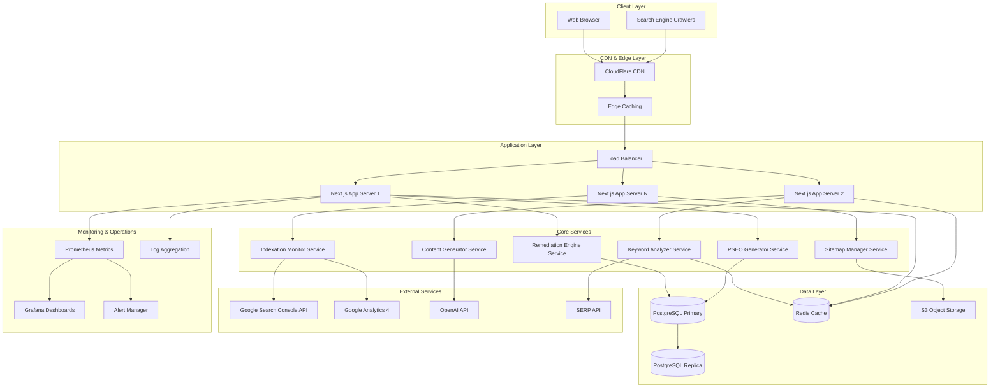

# Design Document

## Overview

### Purpose

This design document specifies the technical architecture, implementation strategy, and system components for the Professional SEO/PSEO Enhancement & Expansion Project. The system addresses critical indexation failures affecting 10,000+ pages, remediates all errors to achieve 100% indexation of existing 23,000 pages, and generates 20,000 new high-performance programmatic SEO (PSEO) pages designed to achieve #1 search rankings and generate 100,000+ weekly impressions.

### Scope

The system encompasses three integrated domains:

1. **SEO Remediation Engine**: Automated detection, classification, and resolution of 5,474 404 errors, 4,409 crawl indexation failures, and 151 duplicate content issues
2. **PSEO Generation System**: Intelligent creation of 20,000 new pages with keyword research, content generation, on-page optimization, and internal linking
3. **Monitoring & Optimization Platform**: Real-time tracking of indexation status, search rankings, traffic metrics, and automated continuous optimization

### Business Goals

- **100% Indexation**: All 43,000 pages (23K existing + 20K new) successfully indexed with zero errors
- **Search Dominance**: #1 rankings for 50+ primary keywords, top 3 for 200+ keywords
- **Traffic Growth**: Generate 100,000+ weekly impressions and 10,000+ weekly organic clicks
- **Technical Excellence**: Core Web Vitals "Good" ratings, Lighthouse scores 90+, WCAG AA compliance
- **Market Leadership**: Establish brand as authority in AI humanization and detection space

### Success Metrics

| Metric | Target | Timeframe |
|--------|--------|-----------|
| Indexation Rate | 100% (43,000 pages) | 14 days post-remediation |
| #1 Rankings | 50+ primary keywords | 90 days |
| Top 3 Rankings | 200+ primary keywords | 90 days |
| Weekly Impressions | 100,000+ | 60 days |
| Weekly Clicks | 10,000+ | 60 days |
| Average CTR | 5%+ | 60 days |
| Lighthouse Performance (Mobile) | 90+ | All pages |
| Core Web Vitals | "Good" ratings | All pages |
| WCAG Compliance | AA Level | All pages |


## Architecture

### System Architecture Overview

The system follows a microservices architecture with distinct, loosely-coupled components orchestrated through an event-driven backbone. This architecture enables independent scaling, deployment, and optimization of each subsystem while maintaining data consistency and operational resilience.



### Architecture Principles

1. **Separation of Concerns**: New PSEO pages (`/pseo_pages/*`) are completely isolated from existing pages with dedicated components, routing, and data models
2. **Microservices Design**: Core services (Remediation, PSEO Generation, Keyword Analysis) operate independently with clear interfaces
3. **Event-Driven Communication**: Services communicate through message queues for asynchronous processing and resilience
4. **Stateless Application Tier**: All application servers are stateless, enabling horizontal scaling
5. **Database Replication**: Read replicas handle analytics and reporting queries, reducing primary database load
6. **Multi-Layer Caching**: CDN edge caching, application-level Redis caching, and database query caching
7. **API-First Design**: All service interactions through well-defined REST/GraphQL APIs
8. **Graceful Degradation**: Non-critical features degrade gracefully under load while maintaining core functionality

### Deployment Architecture

**Production Environment:**
- **Region**: Multi-region deployment (US-East, US-West, EU-West) for global performance
- **Compute**: Kubernetes cluster with auto-scaling (3-20 pods per service)
- **Database**: PostgreSQL 15 with streaming replication (1 primary, 2 replicas)
- **Cache**: Redis Cluster (6 nodes with replication)
- **CDN**: CloudFlare Enterprise with 200+ global edge locations
- **Object Storage**: AWS S3 with CloudFront distribution

**Staging Environment:**
- Identical architecture to production at 50% scale
- Dedicated database instances (no production data)
- Separate CDN distribution for testing

**Development Environment:**
- Docker Compose setup with all services
- PostgreSQL 15 single instance
- Redis single instance
- LocalStack for S3 simulation


## Components and Interfaces

### 1. Remediation Engine Service

**Purpose**: Automated detection, classification, and resolution of SEO errors (404s, crawl failures, duplicates)

**Key Responsibilities:**
- Crawl all 23,000 existing pages to detect indexation issues
- Classify errors by type and root cause
- Implement automated fixes (redirects, canonical tags, content enhancement)
- Generate remediation reports and track resolution progress

**Interfaces:**

```typescript
interface RemediationEngineAPI {
  // Error Detection
  scanSite(): Promise<ScanResult>;
  detectErrors(pageUrls: string[]): Promise<ErrorReport[]>;
  classifyError(error: Error): ErrorType;
  
  // Remediation Actions
  fix404Errors(errors: Error404[]): Promise<RemediationResult>;
  fixCrawlIssues(errors: CrawlError[]): Promise<RemediationResult>;
  fixDuplicateContent(errors: DuplicateError[]): Promise<RemediationResult>;
  
  // Monitoring
  getRemediationStatus(): Promise<RemediationStatus>;
  generateReport(): Promise<RemediationReport>;
}

interface ScanResult {
  totalPages: number;
  scannedPages: number;
  errors404: number;
  crawlErrors: number;
  duplicateErrors: number;
  timestamp: Date;
}

interface ErrorReport {
  url: string;
  errorType: 'NOT_FOUND' | 'CRAWL_FAILED' | 'DUPLICATE';
  severity: 'CRITICAL' | 'HIGH' | 'MEDIUM';
  rootCause: string;
  recommendedFix: string;
}

interface RemediationResult {
  totalErrors: number;
  fixedErrors: number;
  failedFixes: number;
  actionsPerformed: RemediationAction[];
}
```

**Data Flow:**
1. Scheduled job triggers site scan every 24 hours
2. Engine crawls all pages, checks HTTP status, Search Console API
3. Errors classified and stored in database
4. Automated fixes applied based on error type
5. Verification performed 48 hours post-fix
6. Reports generated and alerts sent if issues persist


### 2. Keyword Analyzer Service

**Purpose**: Intelligent keyword research, selection, and assignment for 20,000 PSEO pages

**Key Responsibilities:**
- Research keywords in AI humanization/detection domain
- Calculate keyword metrics (volume, difficulty, CPC, competition)
- Select optimal keywords for each PSEO page
- Prevent keyword cannibalization through unique assignments
- Identify featured snippet opportunities

**Interfaces:**

```typescript
interface KeywordAnalyzerAPI {
  // Keyword Research
  researchKeywords(domains: string[]): Promise<KeywordCandidate[]>;
  analyzeCompetitors(keyword: string): Promise<CompetitorAnalysis>;
  calculateMetrics(keyword: string): Promise<KeywordMetrics>;
  
  // Keyword Selection
  selectKeywords(count: number, filters: KeywordFilter): Promise<Keyword[]>;
  assignKeywords(pageIds: string[]): Promise<KeywordAssignment[]>;
  
  // Validation
  checkCannibalization(): Promise<CannibalizationReport>;
  identifySnippetOpportunities(): Promise<SnippetOpportunity[]>;
}

interface KeywordCandidate {
  keyword: string;
  searchVolume: number;
  keywordDifficulty: number;
  cpc: number;
  competitiveDensity: number;
  trend: 'rising' | 'stable' | 'declining';
  seasonality: boolean;
}

interface KeywordMetrics {
  keyword: string;
  monthlySearchVolume: number;
  annualSearchVolume: number;
  keywordDifficulty: number; // 0-100
  cpc: number;
  projectedImpressions: number;
  projectedClicks: number;
  competitorCount: number;
}

interface KeywordAssignment {
  pageId: string;
  primaryKeyword: Keyword;
  secondaryKeywords: Keyword[];
  relatedTerms: string[];
  targetPosition: number;
  projectedImpressionsMonthly: number;
}
```

**Data Sources:**
- SERP API for search volume and competition data
- Google Keyword Planner API for CPC and trends
- Ahrefs/SEMrush API for keyword difficulty
- Google Trends API for seasonality analysis
- Internal analytics for existing keyword performance


### 3. Content Generator Service

**Purpose**: AI-powered generation of high-quality, unique, SEO-optimized content for PSEO pages

**Key Responsibilities:**
- Generate 1,500-3,000 word articles for each PSEO page
- Ensure 100% content uniqueness across all pages
- Optimize content for assigned keywords (density, placement)
- Structure content with proper heading hierarchy
- Implement E-E-A-T principles (Experience, Expertise, Authoritativeness, Trust)
- Generate meta titles, descriptions, and schema markup

**Interfaces:**

```typescript
interface ContentGeneratorAPI {
  // Content Generation
  generateContent(spec: ContentSpecification): Promise<GeneratedContent>;
  generateBatch(specs: ContentSpecification[]): Promise<GeneratedContent[]>;
  
  // Content Optimization
  optimizeForKeyword(content: string, keyword: Keyword): Promise<OptimizedContent>;
  checkUniqueness(content: string): Promise<UniquenessReport>;
  
  // Metadata Generation
  generateMetadata(content: string, keyword: Keyword): Promise<PageMetadata>;
  generateSchema(content: string, type: SchemaType): Promise<SchemaMarkup>;
}

interface ContentSpecification {
  pageId: string;
  primaryKeyword: Keyword;
  secondaryKeywords: Keyword[];
  wordCountMin: number;
  wordCountMax: number;
  contentType: 'article' | 'guide' | 'comparison' | 'review' | 'faq';
  targetAudience: string;
  tone: 'professional' | 'conversational' | 'technical';
  includeElements: ContentElement[];
}

interface GeneratedContent {
  pageId: string;
  title: string;
  content: string; // HTML formatted
  headingStructure: Heading[];
  wordCount: number;
  readabilityScore: number; // Flesch Reading Ease
  keywordDensity: { [keyword: string]: number };
  uniquenessScore: number; // 0-100%
  eeatScore: number; // 0-100
  generatedAt: Date;
}

interface PageMetadata {
  metaTitle: string; // 50-60 chars
  metaDescription: string; // 150-160 chars
  canonicalUrl: string;
  ogTags: OpenGraphTags;
  twitterCard: TwitterCardTags;
  schemaMarkup: SchemaMarkup;
}
```

**Content Generation Pipeline:**
1. Receive content specification with keywords and parameters
2. Research topic using web scraping and knowledge base
3. Generate outline with H1, H2, H3 structure
4. Generate content sections using GPT-4 with custom prompts
5. Optimize for keyword placement and density
6. Check plagiarism and uniqueness
7. Generate metadata and schema markup
8. Store content and metadata in database


### 4. PSEO Generator Service

**Purpose**: Orchestration of PSEO page creation including keyword assignment, content generation, and deployment

**Key Responsibilities:**
- Coordinate end-to-end PSEO page generation workflow
- Manage generation of 20,000 pages in batches
- Implement internal linking strategy
- Generate page routes and Next.js file structure
- Trigger sitemap updates after page creation

**Interfaces:**

```typescript
interface PSEOGeneratorAPI {
  // Page Generation
  generatePage(pageSpec: PSEOPageSpecification): Promise<PSEOPage>;
  generateBatch(count: number, startIndex: number): Promise<PSEOPage[]>;
  
  // Internal Linking
  buildLinkingGraph(pages: PSEOPage[]): Promise<LinkingGraph>;
  addInternalLinks(pageId: string, targetPageIds: string[]): Promise<void>;
  
  // Deployment
  deployBatch(pageIds: string[]): Promise<DeploymentResult>;
  validateDeployment(pageIds: string[]): Promise<ValidationReport>;
}

interface PSEOPageSpecification {
  slug: string; // URL-friendly identifier
  keywordAssignment: KeywordAssignment;
  contentSpec: ContentSpecification;
  templateType: 'article' | 'comparison' | 'guide' | 'faq';
  priority: number; // 0.0-1.0 for sitemap
}

interface PSEOPage {
  id: string;
  slug: string;
  url: string; // /pseo_pages/{slug}
  title: string;
  content: string;
  metadata: PageMetadata;
  internalLinks: InternalLink[];
  status: 'draft' | 'published' | 'indexed';
  createdAt: Date;
  publishedAt: Date;
  lastModifiedAt: Date;
}

interface InternalLink {
  sourcePageId: string;
  targetPageId: string;
  anchorText: string;
  position: number; // Position in content (word count)
  relevanceScore: number; // 0-1
}
```

**Generation Workflow:**
1. Batch Processing: Generate 1,000 pages per batch (20 batches total)
2. For each page:
   - Get keyword assignment from Keyword Analyzer
   - Generate content via Content Generator
   - Create page metadata and schema
   - Identify related pages for internal linking
   - Store page in database with 'draft' status
3. Post-batch processing:
   - Build internal linking graph for batch
   - Add internal links to content
   - Update pages to 'published' status
   - Trigger sitemap regeneration
   - Submit to Search Console for indexing
4. Monitor indexation status daily


### 5. Sitemap Manager Service

**Purpose**: Dynamic generation, management, and submission of XML sitemaps for all pages

**Key Responsibilities:**
- Generate 4 XML sitemaps for 20,000 PSEO pages (5,000 URLs each)
- Create sitemap index file
- Submit sitemaps to Google Search Console and Bing Webmaster Tools
- Update sitemaps when pages are added/modified
- Validate sitemap compliance with XML protocol

**Interfaces:**

```typescript
interface SitemapManagerAPI {
  // Sitemap Generation
  generateSitemaps(pageIds: string[]): Promise<SitemapFile[]>;
  generateSitemapIndex(sitemapUrls: string[]): Promise<SitemapIndexFile>;
  
  // Sitemap Management
  updateSitemap(sitemapId: string, changes: SitemapChange[]): Promise<void>;
  validateSitemap(sitemapUrl: string): Promise<ValidationResult>;
  
  // Submission
  submitToSearchConsole(sitemapUrls: string[]): Promise<SubmissionResult>;
  submitToBing(sitemapUrls: string[]): Promise<SubmissionResult>;
  
  // Monitoring
  getSitemapStatus(sitemapId: string): Promise<SitemapStatus>;
}

interface SitemapFile {
  id: string;
  filename: string; // sitemap-pseo-1.xml
  url: string; // https://example.com/sitemap-pseo-1.xml
  urlCount: number;
  lastModified: Date;
  compressed: boolean; // Gzip compression
  s3Location: string;
}

interface SitemapEntry {
  loc: string; // URL
  lastmod: string; // ISO 8601 date
  changefreq: 'weekly' | 'daily' | 'monthly';
  priority: number; // 0.0-1.0
}

interface SubmissionResult {
  service: 'google' | 'bing';
  sitemapUrl: string;
  submitted: boolean;
  submittedAt: Date;
  status: 'pending' | 'processed' | 'error';
  errorMessage?: string;
}
```

**Sitemap Structure:**
```
/sitemap-pseo-index.xml (Sitemap Index)
  ├─ /sitemap-pseo-1.xml (URLs 1-5000)
  ├─ /sitemap-pseo-2.xml (URLs 5001-10000)
  ├─ /sitemap-pseo-3.xml (URLs 10001-15000)
  └─ /sitemap-pseo-4.xml (URLs 15001-20000)
```

**Update Strategy:**
- Incremental updates: When new pages added, only regenerate affected sitemap file
- Full regeneration: Weekly full regeneration to ensure consistency
- Compression: All sitemaps Gzip compressed before upload
- Validation: XML schema validation before submission
- Submission: Automatic submission via Search Console API within 1 hour of update


### 6. Indexation Monitor Service

**Purpose**: Real-time monitoring of page indexation status, rankings, and search performance

**Key Responsibilities:**
- Monitor Search Console for indexation status of all pages
- Track keyword rankings daily for all assigned keywords
- Monitor Core Web Vitals and page experience metrics
- Generate alerts for indexation drops or ranking losses
- Provide real-time dashboard data

**Interfaces:**

```typescript
interface IndexationMonitorAPI {
  // Indexation Monitoring
  checkIndexationStatus(pageUrls: string[]): Promise<IndexationStatus[]>;
  getIndexationRate(): Promise<IndexationRate>;
  detectIndexationIssues(): Promise<IndexationIssue[]>;
  
  // Ranking Tracking
  trackRankings(keywords: string[]): Promise<RankingReport>;
  getRankingChanges(days: number): Promise<RankingChange[]>;
  
  // Performance Monitoring
  getCoreWebVitals(pageUrls: string[]): Promise<WebVitalsReport>;
  getPerformanceMetrics(): Promise<PerformanceMetrics>;
  
  // Alerting
  sendAlert(alert: Alert): Promise<void>;
  getActiveAlerts(): Promise<Alert[]>;
}

interface IndexationStatus {
  url: string;
  indexed: boolean;
  status: 'indexed' | 'crawled_not_indexed' | 'discovered_not_indexed' | 'excluded';
  lastCrawled: Date;
  issueDescription?: string;
}

interface RankingReport {
  keyword: string;
  currentPosition: number;
  previousPosition: number;
  change: number;
  pageUrl: string;
  searchVolume: number;
  impressions: number;
  clicks: number;
  ctr: number;
  timestamp: Date;
}

interface WebVitalsReport {
  url: string;
  lcp: number; // Largest Contentful Paint (ms)
  fid: number; // First Input Delay (ms)
  cls: number; // Cumulative Layout Shift
  fcp: number; // First Contentful Paint (ms)
  tti: number; // Time to Interactive (ms)
  rating: 'good' | 'needs_improvement' | 'poor';
}

interface Alert {
  id: string;
  type: 'indexation_drop' | 'ranking_loss' | 'traffic_decline' | 'error_spike' | 'performance_degradation';
  severity: 'critical' | 'high' | 'medium' | 'low';
  message: string;
  affectedUrls: string[];
  createdAt: Date;
  resolvedAt?: Date;
  actionRequired: string;
}
```

**Monitoring Schedule:**
- Indexation Status: Check every 24 hours via Search Console API
- Rankings: Track daily for all 20,000 keywords
- Core Web Vitals: Monitor hourly using RUM (Real User Monitoring)
- Traffic Metrics: Pull from Analytics API every hour
- Error Detection: Continuous monitoring via application logs


### 7. Next.js Application (Frontend & SSR)

**Purpose**: Serve PSEO pages with optimal performance, SEO, and user experience

**Key Responsibilities:**
- Server-side rendering (SSR) of PSEO pages for SEO
- Static generation (SSG) where applicable for performance
- Responsive mobile-first UI rendering
- Client-side navigation and interaction
- Analytics tracking and event logging

**Route Structure:**

```
/pseo_pages/
├─ [slug]/
│  └─ page.tsx          # Dynamic PSEO page component
├─ layout.tsx           # Layout for all PSEO pages
├─ page.tsx             # PSEO landing/index page
└─ api/
   ├─ generate/         # API route for page generation
   ├─ content/          # API route for content fetching
   └─ analytics/        # API route for tracking events
```

**Page Component Architecture:**

```typescript
// /pseo_pages/[slug]/page.tsx
interface PSEOPageProps {
  params: { slug: string };
  searchParams: { [key: string]: string | string[] };
}

export async function generateMetadata({ params }: PSEOPageProps): Promise<Metadata> {
  const page = await fetchPSEOPage(params.slug);
  return {
    title: page.metadata.metaTitle,
    description: page.metadata.metaDescription,
    openGraph: page.metadata.ogTags,
    twitter: page.metadata.twitterCard,
    alternates: {
      canonical: page.metadata.canonicalUrl,
    },
  };
}

export default async function PSEOPage({ params }: PSEOPageProps) {
  const page = await fetchPSEOPage(params.slug);
  
  return (
    <>
      <script
        type="application/ld+json"
        dangerouslySetInnerHTML={{ __html: JSON.stringify(page.metadata.schemaMarkup) }}
      />
      <article className="pseo-article">
        <h1>{page.title}</h1>
        <div dangerouslySetInnerHTML={{ __html: page.content }} />
        <InternalLinks links={page.internalLinks} />
        <CallToAction />
      </article>
    </>
  );
}

// Generate static params for ISR (Incremental Static Regeneration)
export async function generateStaticParams() {
  const pages = await fetchAllPSEOPages();
  return pages.map((page) => ({
    slug: page.slug,
  }));
}
```

**Performance Optimizations:**
- ISR (Incremental Static Regeneration) with 1-hour revalidation
- Image optimization with Next.js Image component (WebP/AVIF)
- Code splitting and lazy loading for non-critical components
- Preloading of critical resources
- Font optimization with `next/font`


## Data Models

### Database Schema (PostgreSQL)

#### 1. PSEO Pages Table

```sql
CREATE TABLE pseo_pages (
  id UUID PRIMARY KEY DEFAULT gen_random_uuid(),
  slug VARCHAR(255) UNIQUE NOT NULL,
  url TEXT NOT NULL,
  title VARCHAR(255) NOT NULL,
  content TEXT NOT NULL,
  content_html TEXT NOT NULL,
  word_count INTEGER NOT NULL,
  
  -- Metadata
  meta_title VARCHAR(60) NOT NULL,
  meta_description VARCHAR(160) NOT NULL,
  canonical_url TEXT NOT NULL,
  schema_markup JSONB NOT NULL,
  og_tags JSONB NOT NULL,
  twitter_card JSONB NOT NULL,
  
  -- Keywords
  primary_keyword_id UUID REFERENCES keywords(id),
  secondary_keyword_ids UUID[] NOT NULL DEFAULT '{}',
  keyword_density JSONB NOT NULL, -- { "keyword": 1.5, ... }
  
  -- Quality Metrics
  uniqueness_score DECIMAL(5,2) NOT NULL, -- 0-100
  readability_score DECIMAL(5,2) NOT NULL, -- Flesch Reading Ease
  eeat_score DECIMAL(5,2) NOT NULL, -- 0-100
  
  -- SEO Metrics
  lighthouse_score_mobile INTEGER, -- 0-100
  lighthouse_score_desktop INTEGER, -- 0-100
  lcp_mobile INTEGER, -- ms
  fid_mobile INTEGER, -- ms
  cls_mobile DECIMAL(4,3), -- 0.000-1.000
  
  -- Status
  status VARCHAR(20) NOT NULL DEFAULT 'draft', -- draft, published, indexed
  published_at TIMESTAMP,
  indexed_at TIMESTAMP,
  last_crawled_at TIMESTAMP,
  
  -- Timestamps
  created_at TIMESTAMP NOT NULL DEFAULT NOW(),
  updated_at TIMESTAMP NOT NULL DEFAULT NOW(),
  
  -- Indexes
  INDEX idx_slug (slug),
  INDEX idx_status (status),
  INDEX idx_primary_keyword (primary_keyword_id),
  INDEX idx_published_at (published_at),
  FULLTEXT INDEX idx_content (content)
);
```

#### 2. Keywords Table

```sql
CREATE TABLE keywords (
  id UUID PRIMARY KEY DEFAULT gen_random_uuid(),
  keyword TEXT UNIQUE NOT NULL,
  normalized_keyword TEXT NOT NULL, -- lowercase, trimmed
  
  -- Metrics
  search_volume_monthly INTEGER NOT NULL,
  search_volume_annual INTEGER NOT NULL,
  keyword_difficulty DECIMAL(5,2) NOT NULL, -- 0-100
  cpc DECIMAL(10,2), -- Cost per click in USD
  competitive_density DECIMAL(5,2), -- 0-100
  
  -- Trends
  trend VARCHAR(20) NOT NULL, -- rising, stable, declining
  seasonality BOOLEAN NOT NULL DEFAULT false,
  trend_data JSONB, -- Monthly search volume history
  
  -- Targeting
  assigned_page_id UUID REFERENCES pseo_pages(id),
  target_position INTEGER NOT NULL DEFAULT 1,
  
  -- Performance
  current_position INTEGER,
  best_position INTEGER,
  impressions_weekly INTEGER DEFAULT 0,
  clicks_weekly INTEGER DEFAULT 0,
  ctr DECIMAL(5,2), -- Click-through rate
  
  -- Timestamps
  created_at TIMESTAMP NOT NULL DEFAULT NOW(),
  updated_at TIMESTAMP NOT NULL DEFAULT NOW(),
  last_tracked_at TIMESTAMP,
  
  -- Indexes
  INDEX idx_keyword (keyword),
  INDEX idx_assigned_page (assigned_page_id),
  INDEX idx_search_volume (search_volume_monthly DESC),
  INDEX idx_difficulty (keyword_difficulty)
);
```


#### 3. Internal Links Table

```sql
CREATE TABLE internal_links (
  id UUID PRIMARY KEY DEFAULT gen_random_uuid(),
  source_page_id UUID NOT NULL REFERENCES pseo_pages(id) ON DELETE CASCADE,
  target_page_id UUID NOT NULL REFERENCES pseo_pages(id) ON DELETE CASCADE,
  anchor_text TEXT NOT NULL,
  position INTEGER NOT NULL, -- Word position in content
  relevance_score DECIMAL(5,2) NOT NULL, -- 0-1
  
  created_at TIMESTAMP NOT NULL DEFAULT NOW(),
  
  -- Constraints
  UNIQUE (source_page_id, target_page_id, position),
  
  -- Indexes
  INDEX idx_source_page (source_page_id),
  INDEX idx_target_page (target_page_id),
  INDEX idx_relevance (relevance_score DESC)
);
```

#### 4. SEO Errors Table

```sql
CREATE TABLE seo_errors (
  id UUID PRIMARY KEY DEFAULT gen_random_uuid(),
  url TEXT NOT NULL,
  error_type VARCHAR(50) NOT NULL, -- NOT_FOUND, CRAWL_FAILED, DUPLICATE, etc.
  severity VARCHAR(20) NOT NULL, -- CRITICAL, HIGH, MEDIUM, LOW
  
  -- Details
  http_status_code INTEGER,
  root_cause TEXT,
  recommended_fix TEXT,
  error_details JSONB,
  
  -- Resolution
  status VARCHAR(20) NOT NULL DEFAULT 'open', -- open, in_progress, fixed, ignored
  fixed_at TIMESTAMP,
  fix_applied TEXT,
  verified_at TIMESTAMP,
  
  -- Timestamps
  detected_at TIMESTAMP NOT NULL DEFAULT NOW(),
  last_checked_at TIMESTAMP NOT NULL DEFAULT NOW(),
  
  -- Indexes
  INDEX idx_url (url),
  INDEX idx_error_type (error_type),
  INDEX idx_status (status),
  INDEX idx_severity (severity)
);
```

#### 5. Ranking History Table

```sql
CREATE TABLE ranking_history (
  id UUID PRIMARY KEY DEFAULT gen_random_uuid(),
  keyword_id UUID NOT NULL REFERENCES keywords(id) ON DELETE CASCADE,
  page_id UUID NOT NULL REFERENCES pseo_pages(id) ON DELETE CASCADE,
  
  -- Ranking Data
  position INTEGER NOT NULL,
  search_volume INTEGER NOT NULL,
  impressions INTEGER NOT NULL,
  clicks INTEGER NOT NULL,
  ctr DECIMAL(5,2) NOT NULL,
  
  -- Competitor Data
  top_competitor_url TEXT,
  top_competitor_position INTEGER,
  
  recorded_at TIMESTAMP NOT NULL DEFAULT NOW(),
  
  -- Indexes
  INDEX idx_keyword_date (keyword_id, recorded_at DESC),
  INDEX idx_page_date (page_id, recorded_at DESC)
);
```

#### 6. Sitemaps Table

```sql
CREATE TABLE sitemaps (
  id UUID PRIMARY KEY DEFAULT gen_random_uuid(),
  filename VARCHAR(255) UNIQUE NOT NULL,
  url TEXT NOT NULL,
  url_count INTEGER NOT NULL,
  
  -- Storage
  s3_bucket VARCHAR(255) NOT NULL,
  s3_key TEXT NOT NULL,
  compressed BOOLEAN NOT NULL DEFAULT true,
  file_size_bytes INTEGER NOT NULL,
  
  -- Submission
  submitted_to_google BOOLEAN NOT NULL DEFAULT false,
  submitted_to_bing BOOLEAN NOT NULL DEFAULT false,
  google_submission_date TIMESTAMP,
  bing_submission_date TIMESTAMP,
  
  -- Status
  last_modified_at TIMESTAMP NOT NULL DEFAULT NOW(),
  created_at TIMESTAMP NOT NULL DEFAULT NOW(),
  
  -- Indexes
  INDEX idx_filename (filename),
  INDEX idx_last_modified (last_modified_at DESC)
);
```


#### 7. Performance Metrics Table

```sql
CREATE TABLE performance_metrics (
  id UUID PRIMARY KEY DEFAULT gen_random_uuid(),
  page_id UUID NOT NULL REFERENCES pseo_pages(id) ON DELETE CASCADE,
  
  -- Core Web Vitals
  lcp INTEGER NOT NULL, -- Largest Contentful Paint (ms)
  fid INTEGER NOT NULL, -- First Input Delay (ms)
  cls DECIMAL(4,3) NOT NULL, -- Cumulative Layout Shift
  fcp INTEGER NOT NULL, -- First Contentful Paint (ms)
  tti INTEGER NOT NULL, -- Time to Interactive (ms)
  tbt INTEGER NOT NULL, -- Total Blocking Time (ms)
  
  -- Lighthouse Scores
  performance_score INTEGER NOT NULL, -- 0-100
  accessibility_score INTEGER NOT NULL, -- 0-100
  best_practices_score INTEGER NOT NULL, -- 0-100
  seo_score INTEGER NOT NULL, -- 0-100
  
  -- Device
  device_type VARCHAR(20) NOT NULL, -- mobile, desktop, tablet
  
  -- Sample Info
  sample_size INTEGER NOT NULL DEFAULT 1,
  
  recorded_at TIMESTAMP NOT NULL DEFAULT NOW(),
  
  -- Indexes
  INDEX idx_page_device_date (page_id, device_type, recorded_at DESC),
  INDEX idx_performance_score (performance_score DESC)
);
```

### Redis Cache Schema

**Cache Keys Structure:**

```typescript
// Page Content Cache
// TTL: 1 hour
`pseo:page:${slug}` → PSEOPage

// Keyword Metrics Cache
// TTL: 24 hours
`pseo:keyword:${keywordId}` → KeywordMetrics

// Ranking Cache
// TTL: 1 hour
`pseo:rankings:${date}` → RankingReport[]

// Indexation Status Cache
// TTL: 6 hours
`pseo:indexation:status` → IndexationRate

// Search Console Data Cache
// TTL: 12 hours
`pseo:search-console:${date}` → SearchConsoleData

// Performance Metrics Cache
// TTL: 1 hour
`pseo:performance:${pageId}` → WebVitalsReport

// Content Generation Queue
// No expiration (manual cleanup)
`pseo:queue:content-generation` → ContentSpecification[]

// Internal Linking Graph
// TTL: 24 hours
`pseo:linking-graph` → LinkingGraph
```

**Cache Invalidation Strategy:**
- Page updates: Invalidate `pseo:page:${slug}` on content modification
- Keyword updates: Invalidate related page and keyword caches
- Rankings: Invalidate daily ranking cache after new data fetch
- Performance: Invalidate after running Lighthouse audits
- Batch invalidation: Clear all caches during major system updates


## Technology Stack

### Frontend & Application Layer

| Component | Technology | Version | Rationale |
|-----------|-----------|---------|-----------|
| Framework | Next.js | 14.x | SSR/SSG for SEO, App Router for modern routing, ISR support |
| UI Library | React | 18.x | Component-based architecture, extensive ecosystem |
| Language | TypeScript | 5.x | Type safety, better IDE support, reduced bugs |
| Styling | Tailwind CSS | 3.x | Utility-first CSS, excellent performance, design system |
| Component Library | shadcn/ui | Latest | Accessible, customizable, built on Radix UI |
| State Management | Zustand | 4.x | Lightweight, simple API, minimal boilerplate |
| Forms | React Hook Form | 7.x | Performance, validation, excellent DX |
| Analytics | Google Analytics 4 | Latest | User tracking, conversion tracking, behavior analysis |

### Backend Services

| Component | Technology | Version | Rationale |
|-----------|-----------|---------|-----------|
| Runtime | Node.js | 20 LTS | Stability, performance, extensive package ecosystem |
| API Framework | Next.js API Routes | 14.x | Co-located with frontend, serverless deployment |
| Database | PostgreSQL | 15.x | ACID compliance, JSONB support, full-text search |
| ORM | Prisma | 5.x | Type-safe queries, migrations, excellent DX |
| Cache | Redis | 7.x | In-memory performance, pub/sub, data structures |
| Message Queue | Bull | 4.x | Redis-based, reliable job processing, retry logic |
| Task Scheduler | node-cron | 3.x | Cron-based scheduling, simple API |

### Content & AI

| Component | Technology | Version | Rationale |
|-----------|-----------|---------|-----------|
| AI Content Generation | OpenAI GPT-4 | Latest | High-quality content, instruction following, reasoning |
| Plagiarism Detection | Copyscape API | Latest | Industry-standard plagiarism detection |
| Readability Analysis | textstat | 0.7.x | Flesch Reading Ease, grade level calculations |
| HTML Sanitization | DOMPurify | 3.x | XSS prevention, safe HTML rendering |
| Markdown Processing | unified + remark | Latest | Content transformation, AST manipulation |

### SEO & Monitoring

| Component | Technology | Version | Rationale |
|-----------|-----------|---------|-----------|
| Search Console Integration | Google Search Console API | v1 | Indexation status, performance data, Core Web Vitals |
| Keyword Research | SERP API | Latest | Search volume, competition, SERP features |
| Rank Tracking | DataForSEO API | Latest | Daily rank tracking, SERP analysis |
| Performance Testing | Lighthouse CI | 10.x | Automated performance audits in CI/CD |
| Accessibility Testing | axe-core | 4.x | WCAG compliance validation |
| Uptime Monitoring | UptimeRobot | Latest | 5-minute checks, alert notifications |


### Infrastructure & DevOps

| Component | Technology | Version | Rationale |
|-----------|-----------|---------|-----------|
| Hosting | Vercel | Enterprise | Automatic scaling, edge network, zero-config deployment |
| CDN | CloudFlare | Enterprise | 200+ edge locations, DDoS protection, WAF |
| Container Orchestration | Kubernetes | 1.28+ | Service orchestration, auto-scaling, self-healing |
| CI/CD | GitHub Actions | Latest | Integrated with GitHub, extensive marketplace |
| Infrastructure as Code | Terraform | 1.6+ | Multi-cloud support, state management |
| Secrets Management | HashiCorp Vault | 1.15+ | Secure secret storage, dynamic credentials |
| Object Storage | AWS S3 | Latest | Scalable storage for sitemaps, images, backups |
| DNS | CloudFlare DNS | Latest | Fast resolution, DNSSEC support |

### Monitoring & Observability

| Component | Technology | Version | Rationale |
|-----------|-----------|---------|-----------|
| Metrics | Prometheus | 2.x | Time-series metrics, powerful query language |
| Visualization | Grafana | 10.x | Beautiful dashboards, alerting, multi-source |
| Logging | Loki | 2.x | Log aggregation, integrated with Grafana |
| Tracing | Jaeger | 1.x | Distributed tracing, performance analysis |
| Error Tracking | Sentry | Latest | Error tracking, performance monitoring, release tracking |
| APM | New Relic | Latest | Application performance monitoring, real-user monitoring |
| Alerting | PagerDuty | Latest | On-call scheduling, incident management |

### Development Tools

| Component | Technology | Version | Rationale |
|-----------|-----------|---------|-----------|
| Package Manager | pnpm | 8.x | Fast, efficient, strict node_modules |
| Linting | ESLint | 8.x | Code quality, consistency, error prevention |
| Formatting | Prettier | 3.x | Consistent code style, automatic formatting |
| Testing Framework | Vitest | 1.x | Fast, Vite-powered, compatible with Jest |
| E2E Testing | Playwright | 1.x | Cross-browser testing, reliable selectors |
| API Testing | Supertest | 6.x | HTTP assertion, integration testing |
| Load Testing | k6 | Latest | Scriptable load testing, excellent metrics |
| Documentation | TypeDoc | Latest | API documentation generation from TypeScript |


## Correctness Properties

### Property 1: Indexation Completeness

**Validates: Requirements 1, 2, 3, 4, 5**

**Formal Specification:**  
∀ page ∈ ValidPages: IndexationStatus(page) = "indexed" ∧ HTTPStatus(page) = 200

**Description**: Every valid page in the system must be successfully indexed by search engines and return a 200 OK HTTP status code.

**Validation Method**: Query Search Console API daily for all 43,000 page URLs and verify indexation status. Alert if any page is not indexed for more than 48 hours.

**Test Strategy**:
- Property-based test: Generate random sample of 1,000 pages, verify all return 200 status
- Integration test: Submit pages to Search Console, verify indexation within 7 days
- Monitoring: Daily automated check of indexation rate, alert if below 99%

### Property 2: Keyword Uniqueness (No Cannibalization)

**Validates: Requirement 7**

**Formal Specification:**  
∀ k1, k2 ∈ Keywords: k1.primaryKeyword = k2.primaryKeyword ⟹ k1.assignedPageId ≠ k2.assignedPageId

**Description**: Each unique primary keyword must be assigned to exactly one page to prevent keyword cannibalization.

**Validation Method**: Database constraint ensuring unique assignment. Daily verification query to detect any violations.

**Test Strategy**:
- Property-based test: Generate 10,000 keyword assignments, verify no duplicates
- Database constraint test: Attempt to assign same keyword to multiple pages, verify failure
- Post-deployment test: Query all keyword assignments, verify uniqueness

### Property 3: Content Uniqueness

**Validates: Requirement 8**

**Formal Specification:**  
∀ p1, p2 ∈ PSEOPages: p1.id ≠ p2.id ⟹ SimilarityScore(p1.content, p2.content) < 0.15

**Description**: All PSEO page content must be unique with similarity scores below 15% to avoid duplicate content penalties.

**Validation Method**: Use plagiarism detection API to compare all page pairs. Cosine similarity on TF-IDF vectors must be below 0.15.

**Test Strategy**:
- Property-based test: Generate 100 content pieces, verify pairwise similarity < 15%
- Batch validation: Check all 20,000 pages against each other using sampling
- Continuous monitoring: Check new pages against existing pages before publication

### Property 4: Performance Bounds

**Validates: Requirements 14, 15**

**Formal Specification:**  
∀ page ∈ PSEOPages: LCP(page) ≤ 2500ms ∧ FID(page) ≤ 100ms ∧ CLS(page) ≤ 0.1

**Description**: All PSEO pages must meet Core Web Vitals "Good" thresholds for mobile devices.

**Validation Method**: Run Lighthouse audits on all pages monthly. Monitor RUM (Real User Monitoring) data daily.

**Test Strategy**:
- Property-based test: Test random sample of 500 pages weekly with Lighthouse
- Load test: Verify performance under 10,000 concurrent users
- CI/CD gate: Fail deployment if any page scores below thresholds

### Property 5: Link Integrity

**Validates: Requirement 10**

**Formal Specification:**  
∀ link ∈ InternalLinks: ∃ page ∈ PSEOPages where page.id = link.targetPageId ∧ HTTPStatus(page.url) = 200

**Description**: All internal links must point to existing, accessible pages with no broken links.

**Validation Method**: Weekly crawl of all internal links, verify HTTP 200 responses. Database foreign key constraints ensure referential integrity.

**Test Strategy**:
- Property-based test: Generate random link graph, verify all targets exist
- Integration test: Create pages with links, delete target pages, verify cascade or prevention
- Monitoring: Daily automated broken link check, alert on any findings

### Property 6: SEO Compliance

**Validates: Requirement 9**

**Formal Specification:**  
∀ page ∈ PSEOPages: LengthOf(page.metaTitle) ∈ [50,60] ∧ LengthOf(page.metaDescription) ∈ [150,160] ∧ Count(page, "h1") = 1

**Description**: All pages must have properly sized meta titles, meta descriptions, and exactly one H1 tag.

**Validation Method**: Automated validation on page save. HTML parser checks H1 count, string length checks on metadata.

**Test Strategy**:
- Property-based test: Generate 1,000 pages with varying metadata, verify all within bounds
- Unit test: Test metadata generation function with boundary cases
- Pre-deployment check: Validate all 20,000 pages before publishing

### Property 7: Accessibility Compliance

**Validates: Requirement 13**

**Formal Specification:**  
∀ page ∈ PSEOPages: WCAGLevel(page) ≥ AA ∧ ContrastRatio(page.text, page.background) ≥ 4.5

**Description**: All pages must meet WCAG 2.1 Level AA standards with proper contrast ratios and semantic HTML.

**Validation Method**: Automated axe-core testing on all pages. Manual testing with screen readers on sample pages.

**Test Strategy**:
- Property-based test: Test 500 random pages with axe-core, verify zero violations
- Manual testing: Screen reader testing on 50 sample pages quarterly
- CI/CD gate: Fail deployment if accessibility score below 100


## Error Handling

### Error Categories and Strategies

#### 1. Network Errors

**Scenarios**:
- External API failures (OpenAI, SERP API, Search Console)
- Database connection timeout
- CDN unavailability

**Handling Strategy**:
- **Retry with Exponential Backoff**: 3 retries with delays: 1s, 2s, 4s
- **Circuit Breaker**: Open circuit after 5 consecutive failures, half-open after 60s
- **Fallback Responses**: Return cached data when available, graceful degradation
- **Error Logging**: Log all failures to Sentry with context (request ID, user, endpoint)
- **Alerts**: Trigger PagerDuty alert if error rate exceeds 5% over 5 minutes

**Example**:
```typescript
async function fetchWithRetry<T>(
  fn: () => Promise<T>,
  retries = 3,
  delay = 1000
): Promise<T> {
  try {
    return await fn();
  } catch (error) {
    if (retries === 0) throw error;
    await new Promise(resolve => setTimeout(resolve, delay));
    return fetchWithRetry(fn, retries - 1, delay * 2);
  }
}
```

#### 2. Data Validation Errors

**Scenarios**:
- Invalid keyword data from APIs
- Malformed content from AI generation
- Schema validation failures

**Handling Strategy**:
- **Input Validation**: Validate all external data with Zod schemas before processing
- **Sanitization**: Sanitize HTML content with DOMPurify before storage
- **Type Safety**: Use TypeScript strict mode to catch type errors at compile time
- **Database Constraints**: Enforce NOT NULL, UNIQUE, FOREIGN KEY at database level
- **User Feedback**: Return 400 Bad Request with detailed error messages

**Example**:
```typescript
import { z } from 'zod';

const KeywordSchema = z.object({
  keyword: z.string().min(2).max(100),
  searchVolume: z.number().int().min(0),
  keywordDifficulty: z.number().min(0).max(100),
});

function validateKeyword(data: unknown): Keyword {
  try {
    return KeywordSchema.parse(data);
  } catch (error) {
    logger.error('Keyword validation failed', { error, data });
    throw new ValidationError('Invalid keyword data');
  }
}
```

#### 3. Resource Exhaustion Errors

**Scenarios**:
- Database connection pool exhausted
- Memory limit exceeded during batch processing
- API rate limits exceeded

**Handling Strategy**:
- **Connection Pooling**: Use Prisma connection pool with max 20 connections
- **Batch Processing**: Process pages in batches of 100 to limit memory usage
- **Rate Limiting**: Implement token bucket algorithm for API calls
- **Graceful Degradation**: Queue requests when resources unavailable
- **Auto-Scaling**: Kubernetes HPA scales pods when CPU > 70% or memory > 80%

**Example**:
```typescript
class RateLimiter {
  private tokens: number;
  private lastRefill: number;
  
  constructor(
    private maxTokens: number,
    private refillRate: number // tokens per second
  ) {
    this.tokens = maxTokens;
    this.lastRefill = Date.now();
  }
  
  async acquire(): Promise<void> {
    this.refillTokens();
    if (this.tokens >= 1) {
      this.tokens--;
      return;
    }
    // Wait until token available
    const waitTime = (1 - this.tokens) / this.refillRate * 1000;
    await new Promise(resolve => setTimeout(resolve, waitTime));
    return this.acquire();
  }
  
  private refillTokens(): void {
    const now = Date.now();
    const elapsed = (now - this.lastRefill) / 1000;
    this.tokens = Math.min(
      this.maxTokens,
      this.tokens + elapsed * this.refillRate
    );
    this.lastRefill = now;
  }
}
```

#### 4. Business Logic Errors

**Scenarios**:
- Duplicate keyword assignment attempted
- Content generation produces low-quality content
- SEO error remediation fails

**Handling Strategy**:
- **Validation Before Action**: Check preconditions before executing operations
- **Transactional Operations**: Use database transactions for multi-step operations
- **Compensating Transactions**: Rollback operations on failure
- **Manual Review Queue**: Flag problematic items for human review
- **Detailed Logging**: Log business rule violations with full context

**Example**:
```typescript
async function assignKeywordToPage(
  keywordId: string,
  pageId: string
): Promise<void> {
  const existingAssignment = await prisma.keyword.findFirst({
    where: { id: keywordId, assignedPageId: { not: null } }
  });
  
  if (existingAssignment) {
    logger.warn('Keyword already assigned', { keywordId, existingAssignment });
    throw new BusinessRuleError(
      'Keyword cannibalization detected',
      { keywordId, existingPageId: existingAssignment.assignedPageId }
    );
  }
  
  await prisma.keyword.update({
    where: { id: keywordId },
    data: { assignedPageId: pageId }
  });
}
```

#### 5. Third-Party Service Failures

**Scenarios**:
- OpenAI API downtime
- Search Console API errors
- CDN outage

**Handling Strategy**:
- **Service Degradation**: Continue operation with reduced functionality
- **Alternative Providers**: Use backup API providers when primary fails
- **Cached Responses**: Serve stale cache data with appropriate headers
- **User Communication**: Display status banner when services degraded
- **SLA Monitoring**: Track third-party uptime and alert on SLA violations

**Error Response Format**:
```typescript
interface ErrorResponse {
  error: {
    code: string; // ERROR_CODE_CONSTANT
    message: string; // Human-readable message
    details?: Record<string, any>; // Additional context
    requestId: string; // For support tracking
    timestamp: string; // ISO 8601
  };
}
```


## Testing Strategy

### Unit Testing

**Scope**: Individual functions, components, and utility methods

**Tools**: Vitest, @testing-library/react

**Coverage Target**: 80% line coverage minimum

**Test Categories**:

1. **Content Generation Functions**
   - Test keyword density calculation
   - Test readability score computation
   - Test HTML sanitization
   - Test metadata generation

2. **Keyword Analysis Functions**
   - Test keyword scoring algorithm
   - Test cannibalization detection
   - Test long-tail keyword generation
   - Test search volume normalization

3. **SEO Utility Functions**
   - Test URL slug generation
   - Test meta tag generation
   - Test schema markup generation
   - Test internal link anchor text generation

**Example Test**:
```typescript
describe('generateMetaDescription', () => {
  it('should generate description within 150-160 characters', () => {
    const content = 'Sample content about AI humanization...';
    const keyword = 'AI humanizer';
    const result = generateMetaDescription(content, keyword);
    
    expect(result.length).toBeGreaterThanOrEqual(150);
    expect(result.length).toBeLessThanOrEqual(160);
    expect(result).toContain(keyword);
  });
  
  it('should include call-to-action', () => {
    const result = generateMetaDescription('Content', 'keyword');
    expect(result).toMatch(/Learn more|Discover|Find out/);
  });
});
```

### Integration Testing

**Scope**: API endpoints, database operations, service interactions

**Tools**: Supertest, Playwright, test database

**Test Categories**:

1. **API Endpoint Tests**
   - POST /api/pseo/generate - Page generation endpoint
   - GET /api/pseo/[slug] - Page retrieval endpoint
   - POST /api/keywords/assign - Keyword assignment endpoint
   - GET /api/analytics/rankings - Ranking data endpoint

2. **Database Operation Tests**
   - CRUD operations on pseo_pages table
   - Transaction rollback on errors
   - Foreign key constraint enforcement
   - Full-text search functionality

3. **Service Integration Tests**
   - Remediation Engine + Database
   - Content Generator + OpenAI API
   - Sitemap Manager + S3 Storage
   - Indexation Monitor + Search Console

**Example Test**:
```typescript
describe('POST /api/pseo/generate', () => {
  it('should generate PSEO page successfully', async () => {
    const spec = {
      slug: 'ai-humanizer-guide',
      keywordId: 'keyword-uuid',
      contentType: 'article'
    };
    
    const response = await request(app)
      .post('/api/pseo/generate')
      .send(spec)
      .expect(201);
    
    expect(response.body).toHaveProperty('id');
    expect(response.body.slug).toBe(spec.slug);
    expect(response.body.status).toBe('published');
    
    // Verify database insertion
    const page = await prisma.pseoPage.findUnique({
      where: { id: response.body.id }
    });
    expect(page).toBeDefined();
  });
  
  it('should reject duplicate slug', async () => {
    const spec = { slug: 'existing-slug', keywordId: 'uuid' };
    await createPage(spec); // Create first page
    
    await request(app)
      .post('/api/pseo/generate')
      .send(spec)
      .expect(409); // Conflict
  });
});
```

### End-to-End Testing

**Scope**: Complete user flows, cross-browser testing

**Tools**: Playwright

**Test Scenarios**:

1. **PSEO Page Viewing Flow**
   - Navigate to /pseo_pages/ai-humanizer-guide
   - Verify page loads successfully
   - Verify content renders correctly
   - Verify internal links clickable
   - Verify mobile responsive design

2. **SEO Metadata Verification**
   - Check meta title in HTML head
   - Check meta description
   - Check Open Graph tags
   - Check structured data (JSON-LD)
   - Check canonical URL

3. **Performance Flow**
   - Load page and measure LCP
   - Interact with page and measure FID
   - Scroll page and measure CLS
   - Verify all Core Web Vitals in "Good" range

**Example Test**:
```typescript
test('PSEO page loads with correct SEO metadata', async ({ page }) => {
  await page.goto('/pseo_pages/ai-humanizer-guide');
  
  // Check title
  const title = await page.title();
  expect(title).toContain('AI Humanizer');
  expect(title.length).toBeGreaterThanOrEqual(50);
  expect(title.length).toBeLessThanOrEqual(60);
  
  // Check meta description
  const metaDesc = await page.locator('meta[name="description"]').getAttribute('content');
  expect(metaDesc?.length).toBeGreaterThanOrEqual(150);
  expect(metaDesc?.length).toBeLessThanOrEqual(160);
  
  // Check structured data
  const schemaScript = await page.locator('script[type="application/ld+json"]').textContent();
  const schema = JSON.parse(schemaScript!);
  expect(schema['@type']).toBe('Article');
});
```

### Property-Based Testing

**Scope**: Correctness properties defined in Correctness Properties section

**Tools**: fast-check (property-based testing library)

**Test Categories**:

1. **Content Uniqueness Property**
   - Generate N random content pieces
   - Verify pairwise similarity below threshold
   - Test with various content lengths and topics

2. **Keyword Uniqueness Property**
   - Generate N keyword-page assignments
   - Verify no duplicate primary keyword assignments
   - Test with various keyword pools

3. **Performance Property**
   - Generate random page specifications
   - Generate pages and run Lighthouse audits
   - Verify all meet performance thresholds

**Example Test**:
```typescript
import fc from 'fast-check';

describe('Content Uniqueness Property', () => {
  it('should generate unique content for all pages', async () => {
    await fc.assert(
      fc.asyncProperty(
        fc.array(fc.record({
          keyword: fc.string({ minLength: 5, maxLength: 50 }),
          topic: fc.string({ minLength: 10, maxLength: 100 })
        }), { minLength: 10, maxLength: 100 }),
        async (specs) => {
          const contents = await Promise.all(
            specs.map(spec => generateContent(spec))
          );
          
          // Check pairwise similarity
          for (let i = 0; i < contents.length; i++) {
            for (let j = i + 1; j < contents.length; j++) {
              const similarity = calculateSimilarity(
                contents[i].content,
                contents[j].content
              );
              expect(similarity).toBeLessThan(0.15);
            }
          }
        }
      ),
      { numRuns: 50 } // Run 50 times with random inputs
    );
  });
});
```

### Performance Testing

**Scope**: Load testing, stress testing, endurance testing

**Tools**: k6, Artillery

**Test Scenarios**:

1. **Load Test**: Simulate 10,000 concurrent users browsing PSEO pages
2. **Stress Test**: Gradually increase load until system breaks, identify limits
3. **Spike Test**: Sudden traffic spike from 100 to 10,000 users
4. **Endurance Test**: Sustained load of 5,000 users for 24 hours

**Load Test Script**:
```javascript
import http from 'k6/http';
import { check, sleep } from 'k6';

export const options = {
  stages: [
    { duration: '2m', target: 100 },
    { duration: '5m', target: 1000 },
    { duration: '10m', target: 10000 },
    { duration: '5m', target: 0 },
  ],
  thresholds: {
    http_req_duration: ['p(95)<2000'], // 95% under 2s
    http_req_failed: ['rate<0.01'], // Less than 1% errors
  },
};

export default function () {
  const slugs = ['ai-humanizer', 'ai-detector', 'bypass-detection'];
  const slug = slugs[Math.floor(Math.random() * slugs.length)];
  
  const res = http.get(`https://example.com/pseo_pages/${slug}`);
  
  check(res, {
    'status is 200': (r) => r.status === 200,
    'LCP < 2.5s': (r) => r.timings.duration < 2500,
    'content loaded': (r) => r.body.includes('article'),
  });
  
  sleep(Math.random() * 3 + 1); // Random 1-4 second think time
}
```

### Regression Testing

**Scope**: Ensure existing functionality not broken by changes

**Strategy**:
- Run full test suite on every pull request
- Maintain snapshot tests for UI components
- Track performance metrics over time, alert on regression
- Visual regression testing with Playwright screenshots

### Continuous Testing in CI/CD

**GitHub Actions Workflow**:
```yaml
name: Test Pipeline

on: [push, pull_request]

jobs:
  unit-tests:
    runs-on: ubuntu-latest
    steps:
      - uses: actions/checkout@v3
      - uses: actions/setup-node@v3
      - run: pnpm install
      - run: pnpm test:unit
      - run: pnpm test:coverage
  
  integration-tests:
    runs-on: ubuntu-latest
    services:
      postgres:
        image: postgres:15
      redis:
        image: redis:7
    steps:
      - uses: actions/checkout@v3
      - run: pnpm install
      - run: pnpm test:integration
  
  e2e-tests:
    runs-on: ubuntu-latest
    steps:
      - uses: actions/checkout@v3
      - run: pnpm install
      - run: pnpm playwright install
      - run: pnpm test:e2e
  
  lighthouse:
    runs-on: ubuntu-latest
    steps:
      - uses: actions/checkout@v3
      - uses: treosh/lighthouse-ci-action@v9
        with:
          urls: |
            https://staging.example.com/pseo_pages/sample-page
          uploadArtifacts: true
          temporaryPublicStorage: true
```

### Testing Metrics and Goals

| Metric | Target | Current | Status |
|--------|--------|---------|--------|
| Unit Test Coverage | 80%+ | TBD | 🟡 Pending |
| Integration Test Coverage | 70%+ | TBD | 🟡 Pending |
| E2E Test Coverage | Critical paths | TBD | 🟡 Pending |
| Test Execution Time | < 10 minutes | TBD | 🟡 Pending |
| Flaky Test Rate | < 1% | TBD | 🟡 Pending |
| Property Test Runs | 100+ per property | TBD | 🟡 Pending |
